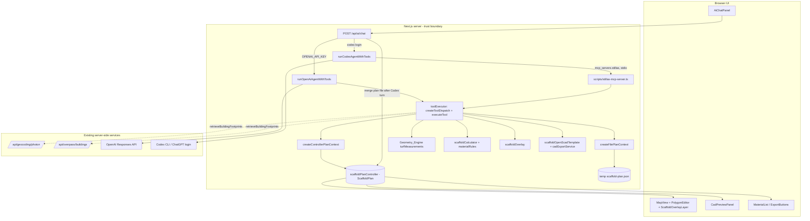
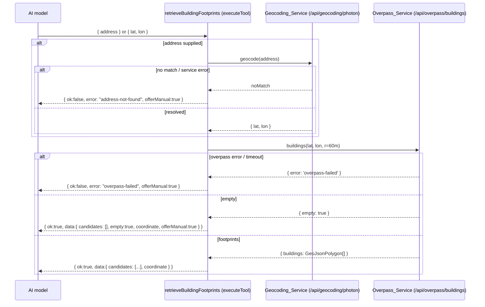

# Design Document

## Overview

This feature **hardens and guarantees** AI-agent capabilities that already exist in StillasCalculator, adds the one genuinely missing capability (`retrieveBuildingFootprints`), and retires a dormant legacy path. It is not a greenfield build. The architecture described here is the architecture already realized by the implementation plan `codex_tools_+_cad_4d25af51.plan.md` (whose Phase 1–3 todos are marked completed) and verified against the current sources; this document promotes that plan into a proper design anchored to the 12 hardening requirements in `requirements.md`.

The architectural rule inherited from the stillas-calculator spec still governs everything:

> **The AI talks. The calculator engine calculates. The report module documents.**

What that rule now has to hold for is *two* AI provider backends, not one. The current code already routes both the **OpenAI_Provider** (OpenAI Responses API, `lib/ai/openAiAgentLoop.ts`) and the **Codex_Provider** (Codex SDK + Stillas MCP server, `lib/ai/codexAgentRunner.ts`) through a single shared deterministic tool layer (`lib/ai/toolExecutor.ts`) backed by a single `ScaffoldPlan` source of truth (`scaffoldPlanController`). The job of this feature is to **prove and lock in** that this is true and stays true.

### What this feature does

- **(a) Make tool access non-optional and provider-agnostic.** Both providers build their tool surface from the same `getToolDefinitions()`/`createToolDispatch()` and execute through the same deterministic engine functions, so a tool call returns the same `ToolResult` regardless of which backend ran (Req 1, 2).
- **(b) Hold the trust boundary and field validation identically on both backends.** Every stateful write goes through a validated `Plan_Updater` — `createControllerPlanContext` → `scaffoldPlanController` on the OpenAI path, `createFilePlanContext` on the MCP path — with identical numeric ranges (Req 3).
- **(c) Keep AI-produced geometry flowing through the deterministic engine and user-correctable.** The AI only ever supplies *candidate* geometry; the `Geometry_Engine` computes every perimeter, area, side length, and `Scaffold_Length`, and every AI-produced perimeter is stored through the same `setPerimeter` updater used for manual drawing (Req 6, 7, 8, 12).
- **(d) Keep the Codex sandbox enforced** — read-only filesystem, no automatic command approval, no direct model network access, disabled web search (Req 9).
- **(e) Make deadline, state preservation, and availability handling uniform** across both providers (Req 10, 11).
- **Add `retrieveBuildingFootprints`** — the net-new Geometry_Tool that resolves an address (or coordinate) to candidate building footprints server-side, so the assistant can "draw the house from the address provided" end to end (Req 5).
- **Retire the legacy tool-less `runCodexSdkChat`** in `lib/ai/codexSdkAdapter.ts`, leaving a single tool-enabled Codex path while keeping `getCodexCliAuthStatus`/`startCodexChatGptSignIn` (Req 2.7).

### Goals

- Identical, trustworthy tool behavior regardless of which AI backend is configured (Req 1, 2).
- A single trust boundary and identical field validation on both providers — the model can never corrupt the project (Req 3, 8, 9).
- Every measurement and quantity originates from the deterministic engine; nothing the model "computes" is ever presented (Req 4, 7, 8).
- An end-to-end "draw the house at this address" flow built only from existing server-side open services (Req 5, 6).
- Bounded, safe failure on every backend within a uniform 45-second deadline (Req 10, 11).
- No dormant code path that could silently regress the tool-access guarantee (Req 2.7).

### Research and grounding summary

The design is grounded in the current sources rather than external research; the relevant findings are facts about the code as built:

- **The Codex path is already tool-enabled.** `runCodexAgentWithTools` starts a Codex thread configured with `mcp_servers.stillas` pointing at `scripts/stillas-mcp-server.ts`, streams the turn with `runStreamed()`, and collects `mcp_tool_call` completion events into `toolResults`. The legacy `runCodexSdkChat` (a single tool-less `thread.run()` embedding a JSON snapshot) is no longer wired into the chat route and is the path being retired (Req 2.7).
- **One shared executor serves both providers.** `lib/ai/toolExecutor.ts` defines `AI_TOOLS` and `createToolDispatch`. The OpenAI loop attaches `getToolDefinitions()` as function tools and calls `executeTool` directly; the MCP server lists the same definitions and calls the same `executeTool`. This is the structural basis for provider-agnostic equivalence (Req 1).
- **The single source of truth is a `ScaffoldPlan`.** `scaffoldPlanController` (the `projectStateController` singleton, aliased) owns the in-memory plan with `drawing{}` and `cad{}` slots. The MCP path carries the same `ScaffoldPlan` shape through a synced temp plan file and mutates it via `createFilePlanContext`, which re-implements the controller's validation ranges exactly (`0.01–100` working height, `0.01–5` calculator dimensions, ring validation via `isValidPerimeter`).
- **The footprint/geocoding services already exist server-side.** `/api/overpass/buildings` (60 m radius, 25 s overall deadline, mirror failover, `empty`/`error` fallback signals) and `/api/geocoding/photon` (Photon with one Nominatim fallback, `noMatch` signal). `retrieveBuildingFootprints` composes these two existing routes server-side rather than introducing any new network stack.
- **The CAD pipeline is deterministic, not LLM-generated.** `lib/cad/scaffoldOpenScadTemplate.ts` template-generates OpenSCAD from `ScaffoldPlan` parameters; `lib/cad/cadExportService.ts` writes `.scad` always and shells out to the `openscad` CLI for `.stl`/`.dxf`. Per the plan, the browser-side `openscad-wasm` preview path is GPL and must stay client-side with a license notice; the server uses the CLI when present.

### Technology stack (unchanged from stillas-calculator)

| Concern | Technology | Notes |
| --- | --- | --- |
| Framework / SSR / API routes | Next.js (App Router), React, TypeScript | unchanged |
| AI — OpenAI path | OpenAI Responses API (function calling + Structured Outputs) | `runOpenAiAgentWithTools`, server-side key |
| AI — Codex path | `@openai/codex-sdk` + `@modelcontextprotocol/sdk` (stdio) | `runCodexAgentWithTools` + `scripts/stillas-mcp-server.ts`, local `codex login` |
| Geometry math | Turf.js (`lib/geometry/turfMeasurements.ts`) | deterministic engine |
| Geocoding | Photon (primary), Nominatim (fallback) | `/api/geocoding/photon`, server-side |
| Building footprints | Overpass API (mirror failover) | `/api/overpass/buildings`, server-side |
| CAD model | Deterministic OpenSCAD template | `lib/cad/scaffoldOpenScadTemplate.ts` |
| CAD export | OpenSCAD CLI (server) / `openscad-wasm` (client preview, GPL) | `lib/cad/cadExportService.ts`, `/api/cad/export` |

### Out of scope / future

The plan's later phases are **explicitly out of scope** for this feature because `requirements.md` does not cover them:

- **Phase 4 — Cesium 3D Tiles** (geospatial 3D viewer / `renderGeospatialPreview`). Deferred. No requirement constrains it.
- **Phase 5 — Pascal architectural editor** (BIM-style walls/floors). Deferred. No requirement constrains it.

When either is taken up it should get its own spec. Nothing in this design adds, declares, or stubs those tools.

## Architecture

### High-level architecture

StillasCalculator remains a single Next.js application. The browser hosts the React UI and renders the map, polygon editor, scaffold overlay, CAD preview, and chat panel. The server route `POST /api/ai/chat` owns the AI trust boundary and dispatches to exactly one of two provider adapters per request. Both adapters converge on the same deterministic `Tool_Dispatch` and the same `ScaffoldPlan`.



**Key design choice (inherited from the plan):** one shared `toolExecutor` implements every tool once. The OpenAI path calls it in-process through `createControllerPlanContext` (mutating the live singleton controller). The Codex path reaches the same executor through the MCP server, which mutates a per-request temp `ScaffoldPlan` file via `createFilePlanContext`; the chat route merges that file back into the controller after the turn. Both contexts implement the identical `PlanToolContext` interface with identical validation, which is what makes cross-provider equivalence a structural property rather than a hope.

### The two provider data flows

**OpenAI_Provider path** (`runOpenAiAgentWithTools`):

1. The route constructs `OpenAI` with the server-side key and calls the agent loop with the conversation, a `sessionId`, and an abort signal bound to `REQUEST_TIMEOUT_MS` (45 s).
2. The loop builds `createControllerPlanContext(scaffoldPlanController, sessionId)` → `createToolDispatch(context)`, and attaches `getToolDefinitions()` as strict function tools.
3. It runs the Responses API in a bounded loop of at most `MAX_TOOL_ITERATIONS = 8` round-trips. For each `function_call` it parses arguments, calls `executeTool`, validates any Structured_Output candidate, appends a `function_call_output`, and re-invokes the model.
4. It returns `{ reply, toolResults, structuredOutput? }`. The route attaches the live `scaffoldPlanController.getScaffoldPlan()` as `scaffoldPlan`.

**Codex_Provider path** (`runCodexAgentWithTools`):

1. The route serializes the current `ScaffoldPlan` to a temp file and calls the runner with the conversation, the initial plan, and a `sessionId`.
2. The runner writes the plan file, constructs `Codex` with `mcp_servers.stillas` (command `npx tsx scripts/stillas-mcp-server.ts`, env `STILLAS_PLAN_FILE` + `STILLAS_SESSION_ID`), and starts a thread with the four sandbox flags (`sandboxMode: 'read-only'`, `approvalPolicy: 'never'`, `networkAccessEnabled: false`, `webSearchMode: 'disabled'`).
3. It calls `runStreamed()` and consumes `ThreadEvent`s: each completed `mcp_tool_call` is parsed into a `CodexToolResult`; the `agent_message` becomes the reply; a `turn.failed` becomes an error result. The abort timer enforces `DEFAULT_CODEX_TIMEOUT_MS` (45 s, overridable by `STILLAS_CODEX_TIMEOUT_MS`).
4. After the turn it reads the (MCP-mutated) plan file back into a `ScaffoldPlan` and returns `{ reply, toolResults, scaffoldPlan }`. The route applies that plan to `scaffoldPlanController` so the UI syncs.

Inside the MCP server, every `CallToolRequest` loads the plan file, builds `createFilePlanContext` over it, runs the same `executeTool`, and writes the mutated plan back — the identical dispatch and validation the OpenAI path uses in-process.

### Provider selection and the mandatory-tool guard

The route selects a provider from `getAiProviderPreference()` and credential availability (`getOpenAiApiKey()`, Codex login status):

- `off` → return `{ unavailable: true }`.
- Prefer OpenAI when `preference !== 'codex-cli'` and a key exists; otherwise take the Codex path (unless `preference === 'openai-api'` without a key, which is unavailable).
- For each request the route computes `requiresTools = messageRequiresTools(latestUserMessage)` (a keyword test for action intent: calculate/draw/export/cad/scaffold/material/facade/perimeter/estimate/bom/report).
- **Mandatory-tool retry guard (Codex path):** if `requiresTools` but the Codex turn executed zero tools, the route issues exactly one retry that injects an explicit "you must call the Stillas MCP tools" instruction. If the retry still executed zero tools, the route returns a `502` error rather than letting the model answer with un-tooled prose.
- **Mandatory-tool guard (OpenAI path):** if `requiresTools` but `toolResults` is empty, the route returns the same `502` error shape.

This guard is what operationalizes "tool access is non-optional" (Req 2) at the route layer; the structural guarantee (same tools on both providers) lives in `toolExecutor.ts`.

### Trust boundary and security

- **Secrets stay server-side.** The OpenAI key is read only inside the route; the Codex session is the local `codex login` state. No AI credential is serialized to the client (Req 11.4).
- **Tool arguments are untrusted.** Both providers admit only arguments conforming to each tool's JSON Schema before execution (OpenAI `strict` function tools; MCP `inputSchema`), and the dispatch itself validates field ranges again through the `Plan_Updater` (Req 9.3, 3.1).
- **External services stay server-side.** `retrieveBuildingFootprints` calls `/api/geocoding/photon` and `/api/overpass/buildings` server-side only; the model never receives those endpoints (Req 5.6).
- **The Codex model gets the sandbox, not the machine.** The four sandbox flags are set on every Codex thread, and every external effect is mediated by the MCP `Tool_Dispatch` (Req 9.1, 9.2).
- **Bounded work.** Both providers cap tool round-trips (OpenAI `MAX_TOOL_ITERATIONS = 8`; Codex bounded by the streamed turn within the deadline) and the whole request is bounded by the 45 s `Request_Deadline` (Req 9.4, 9.6, 10.1).

## Components and Interfaces

This section documents the components as built and the interface changes this feature introduces (the new tool, the retirement, and the system-prompt note for `retrieveBuildingFootprints`).

### Shared tool layer — `lib/ai/toolExecutor.ts`

The single execution path for every tool from any provider. Unchanged in shape except for adding `retrieveBuildingFootprints` to `ToolName`, `AI_TOOLS`, and `createToolDispatch`.

```typescript
export type ToolName =
  | 'getScaffoldPlan'
  | 'calculateScaffoldMaterials'
  | 'getSelectedBuildingMeasurements'
  | 'getAvailableScaffoldSystems'
  | 'updateWorkingHeight'
  | 'generateMaterialList'
  | 'generateReportSummary'
  | 'setBuildingPerimeter'
  | 'selectFacadeSides'
  | 'setScaffoldSystem'
  | 'setScaffoldDimensions'
  | 'generateScaffoldDrawing'
  | 'clearScaffoldDrawing'
  | 'generateCadModel'
  | 'exportCadFormat'
  | 'retrieveBuildingFootprints'; // net-new (Req 5)

export type ToolResult =
  | { ok: true; data: unknown }
  | { ok: false; error: string };

// getToolDefinitions() returns AI_TOOLS verbatim — the same list both providers consume.
export function createToolDispatch(context: PlanToolContext): Record<ToolName, ToolExecutorFn>;
export function executeTool(
  dispatch: Record<ToolName, ToolExecutorFn>,
  context: PlanToolContext,
  name: ToolName,
  args: unknown,
): Promise<ToolResult>;
```

Notes grounded in the current code:
- Synchronous tools return `ToolResult` directly from `createToolDispatch`. `exportCadFormat` (and the new `retrieveBuildingFootprints`) require async I/O and are handled in `executeTool` rather than the synchronous dispatch table — the dispatch entry returns a guard error instructing callers to use `executeTool`.
- An unknown tool name yields `{ ok: false, error: 'Unknown tool "..."' }` and executes nothing (Req 1.4).

### Plan tool context — `lib/ai/planToolContext.ts`

`PlanToolContext` is the validated mutation surface (`Plan_Updater`). Two implementations exist and must stay behaviorally identical:

- `createControllerPlanContext(controller, cadSessionId)` — delegates every updater to `scaffoldPlanController` (OpenAI / in-process path).
- `createFilePlanContext(getPlan, setPlan, cadSessionId)` — mutates a plain `ScaffoldPlan` object (MCP / file path), re-implementing the same validation ranges inline:
  - working height `0.01–100` m,
  - calculator dimensions `0.01–5` m,
  - perimeter via `isValidPerimeter` then `measurePolygon` + `computeScaffoldLength`,
  - unknown scaffold system rejected,
  - every accepted mutation bumps `version`.

Both expose `getCadSessionId()` and `getCadExportDir()` for CAD export paths. This duality is the subject of Property C and Property I (the two contexts must agree).

### MCP server — `scripts/stillas-mcp-server.ts`

A stdio MCP server that exposes the deterministic tools to Codex:

- `ListTools` → `getToolDefinitions().map(def => ({ name, description, inputSchema: def.parameters }))` — the identical tool set, so the Codex surface cannot drift from the OpenAI surface (Req 2.1).
- `CallTool` → load the plan file, `executeTool(dispatch, context, name, args)`, save the plan file; success returns the JSON `data` as a text block, failure returns `{ error }` with `isError: true`.
- Env contract: `STILLAS_PLAN_FILE` (required), `STILLAS_SESSION_ID` (optional, default `mcp-default`).

### Codex runner — `lib/ai/codexAgentRunner.ts`

```typescript
export async function runCodexAgentWithTools(
  messages: readonly ChatMessage[],
  initialPlan: ScaffoldPlan,
  sessionId: string,
): Promise<CodexAgentResult>; // { ok, reply, toolResults, scaffoldPlan } | { ok:false, unavailable?|timedOut?, error }

export function messageRequiresTools(content: string): boolean;
```

Responsibilities: auth check (`getCodexCliAuthStatus`), temp dir + plan-file write, `Codex` construction with the MCP server config and the four sandbox flags, `runStreamed()` consumption of `mcp_tool_call`/`agent_message`/`turn.failed`, abort-based deadline, plan-file read-back, best-effort temp cleanup.

### OpenAI agent loop — `lib/ai/openAiAgentLoop.ts`

```typescript
export const MAX_TOOL_ITERATIONS = 8;
export async function runOpenAiAgentWithTools(
  client: OpenAI, messages: ChatMessage[], sessionId: string, signal: AbortSignal, model?: string,
): Promise<OpenAiAgentResult>; // { reply, toolResults, structuredOutput? }
export class StructuredOutputError extends Error { /* schemaName, issues */ }
```

Responsibilities: build the controller-backed context + dispatch, attach strict function tools, loop ≤ 8 round-trips, execute tools, validate Structured_Output via `buildStructuredOutput` (throws `StructuredOutputError` on nonconformance), thread the abort signal everywhere.

### Unified chat route — `app/api/ai/chat/route.ts`

```typescript
const REQUEST_TIMEOUT_MS = 45_000;

export interface AiChatRequest  { messages: ChatMessage[]; projectState?: ScaffoldPlan; sessionId?: string }
export interface AiChatResponse {
  reply?: string;
  toolResults?: AiToolResult[];
  structuredOutput?: unknown;
  scaffoldPlan?: ScaffoldPlan;
  unavailable?: boolean;
  error?: string;
  timedOut?: boolean;
}
export interface AiToolResult { tool: string; ok: boolean; data?: unknown; error?: string }
```

The response shape is identical for both providers (Req 1.5, 1.6, 10.4). Status mapping: success `200`; `unavailable` `200` with `{ unavailable: true }`; mandatory-tool violation `502`; provider/structured error `502`; timeout `504`.

### System prompt — `lib/ai/systemPrompt.ts`

The mandatory-tool rule is already present. This feature adds one line documenting `retrieveBuildingFootprints` so the model knows to call it for "draw the house at \<address\>" requests and to select a candidate and store it via `setBuildingPerimeter` (Req 5.2, 6.2). No behavioral logic lives in the prompt; the route's `messageRequiresTools` guard remains the enforcement mechanism.

### Client sync — `lib/ai/chatClient.ts` + `components/StillasCalculatorApp.tsx`

`sendChatRequest` posts the chronological conversation and normalizes the untrusted response into a `ChatOutcome` (`ok` / `rejected` / `unavailable` / `error`, with `scaffoldPlan` carried when present). `StillasCalculatorApp` applies a returned `scaffoldPlan` to the controller so the map, overlay, material list, and CAD preview update without manual refresh. (Note: a stale comment in `chatClient.ts` references a "30 s" timeout; the actual deadline is 45 s — see Error Handling.)

### Drawing — `lib/drawing/scaffoldOverlay.ts` + `components/map/ScaffoldOverlayLayer.tsx`

`buildScaffoldOverlay(plan)` is a pure function producing a GeoJSON `FeatureCollection` (facade-run lines, bay ticks, a scaffold-meta polygon) derived only from engine measurements and the calculation — never from AI numbers. `generateScaffoldDrawing` stores it on `plan.drawing`; `clearScaffoldDrawing` removes it without touching the perimeter, measurements, or facade selection (Req 6.6). `ScaffoldOverlayLayer` subscribes to the controller and renders the overlay on MapLibre.

### CAD — template, export service, route, preview

- `lib/cad/scaffoldOpenScadTemplate.ts`: `extractOpenScadParameters(plan)` returns `null` until calculation and dimensions exist; `buildScaffoldOpenScad(plan)` template-generates deterministic OpenSCAD.
- `lib/cad/cadExportService.ts`: writes `.scad` always; shells out to the `openscad` CLI for `.stl`/`.dxf`, returning a `downloadUrl` to `/api/cad/export`.
- `app/api/cad/export/route.ts`: serves the generated file by `session`+`format`, sanitizing the session id.
- `components/cad/CadPreviewPanel.tsx`: client-side preview. The `openscad-wasm` compile path is **GPL** and must remain client-side with a visible license notice (per the plan's risk table); the server uses the CLI when installed and otherwise instructs the user to export `.scad` and compile in the browser preview.

### Net-new Geometry_Tool: `retrieveBuildingFootprints` (Req 5)

This is the only net-new capability. It composes the two existing server-side services and returns candidate footprints for the model to confirm.

**Tool definition** (added to `AI_TOOLS`, schema added to `lib/ai/schemas.ts`):

```typescript
export const RETRIEVE_BUILDING_FOOTPRINTS_PARAMS: JsonSchema = {
  type: 'object',
  properties: {
    // The model supplies exactly one of address or coordinate. Strict mode
    // requires every property listed in `required`, so absent values are null.
    address: {
      type: ['string', 'null'],
      description: 'Free-text address to geocode (e.g. "Storgata 1, Oslo"). Null if a coordinate is supplied.',
    },
    lat: { type: ['number', 'null'], description: 'Latitude (-90..90). Null if an address is supplied.' },
    lon: { type: ['number', 'null'], description: 'Longitude (-180..180). Null if an address is supplied.' },
  },
  required: ['address', 'lat', 'lon'],
  additionalProperties: false,
};
```

**Resolution flow (all server-side):**



**`Tool_Result` shape (success):**

```typescript
interface RetrieveFootprintsData {
  coordinate: { lat: number; lon: number };   // resolved/echoed coordinate
  candidates: Array<{
    index: number;                             // stable index the model references
    polygon: GeoJsonPolygon;                   // closed [lon,lat] ring, engine-ready
    perimeterMeters: number;                   // from Geometry_Engine (preview)
    areaSquareMeters: number;                  // from Geometry_Engine (preview)
  }>;
  empty?: boolean;                             // true when no footprint in 60 m (Req 5.4)
  offerManual?: boolean;                       // hint the model to offer manual drawing
}
```

**Behavior, mapped to Req 5:**
- Accepts an address or a coordinate; resolves an address to a coordinate via the Geocoding_Service; queries the Overpass_Service within 60 m; both calls server-side (5.1, 5.6).
- Returns candidate footprints as a `Tool_Result` so the model can confirm one with the user (5.3). The tool does **not** store anything — selecting a footprint is a separate step.
- No footprints in 60 m → `{ ok:true, empty:true, candidates:[] }`; the model informs the user and offers manual drawing/dimensions (5.4).
- Overpass network error / non-success / 25 s timeout → `{ ok:false, error:'overpass-failed' }`; Project_State preserved; offer manual drawing (5.5).
- Geocoding no-match / service error → `{ ok:false, error:'address-not-found' }`; Project_State preserved; offer manual drawing or prompt for a more specific address/coordinate (5.7).
- Reuses each route's existing deadline/fallback signals (`noMatch`, `empty`, `error: 'overpass-failed'`) rather than inventing new failure semantics.

**Storing a chosen footprint (Req 6.2):** the tool itself never writes the perimeter. When the model (with user confirmation) picks `candidates[i]`, it calls `setBuildingPerimeter` with `candidates[i].polygon`, which validates via the Geometry_Engine and stores through the same `Plan_Updater` as manual drawing, replacing any prior perimeter. This keeps the "candidate vs. committed perimeter" separation that Req 6 requires and means footprint selection inherits all of Req 6/7/8's correctness guarantees for free.

### Retirement of the legacy tool-less path (Req 2.7)

`lib/ai/codexSdkAdapter.ts` currently exports three things: `getCodexCliAuthStatus`, `startCodexChatGptSignIn` (both still used), and `runCodexSdkChat` (the legacy tool-less chat). The chat route no longer calls `runCodexSdkChat`. This feature removes `runCodexSdkChat` and its private helpers that become unused after removal (`buildCodexSdkPrompt`, `summarizeProjectState`, `summarizeCodexFailure`, `getCodexTimeoutMs`, `runCodexSdkChat`'s `CodexSdkChatResult` type), while **keeping** the auth/sign-in discovery helpers (`getCodexCommandCandidates`, `findLoggedInCodex`, `getCodexLoginStatus`, etc.) that `getCodexCliAuthStatus`/`startCodexChatGptSignIn` depend on. The net effect: the only Codex chat entry point is `runCodexAgentWithTools`, with no dormant tool-less code path (Property O).

## Data Models

The core data model is unchanged; this feature adds no new persistent shape. The single source of truth is `ScaffoldPlan` (defined in `lib/types.ts`), which extends the stillas-calculator `ProjectState` with a `version` and the `drawing`/`cad` slots:

```typescript
interface ScaffoldPlan extends ProjectState {
  version: number;                 // monotonic; bumped on every accepted mutation
  drawing: ScaffoldPlanDrawing;    // 2D overlay derived from engine + calculation
  cad: ScaffoldPlanCad;            // deterministic OpenSCAD source + export records
}

interface ScaffoldPlanDrawing {
  overlayGeoJson: GeoJsonFeatureCollection | null;
  lastGeneratedAt: number | null;
}

interface ScaffoldPlanCad {
  openScadSource: string | null;
  parameters: Record<string, number>; // bayLength, numBays, numLevels, scaffoldWidth, ...
  exports: CadExportRecord[];          // { format: 'scad'|'stl'|'dxf'; pathOrUrl }
  lastGeneratedAt: number | null;
}

interface GeoJsonPolygon {
  type: 'Polygon';
  coordinates: number[][][]; // single closed ring of [lon, lat] pairs
}
```

`ProjectState` (address, `perimeterPolygon`, `measurements`, `selectedFacadeSideIndices`, `scaffoldLengthMeters`, scaffold config, `calculation`, `materialListAdjusted`, `aiMessages`, `aiSummary`) is the slice every existing view already reads.

**Plan transport on the MCP path.** `lib/scaffold/scaffoldPlan.ts` provides `createScaffoldPlan`, `parseScaffoldPlan`, and `toProjectState`. `lib/ai/planFileSync.ts` writes/reads the temp `scaffold-plan.json` and resolves the CAD export dir (`.stillas-cad/<sessionId>`). The plan round-trips JSON → disk → JSON via `parseScaffoldPlan`, which defaults missing `drawing`/`cad`/`version` so an older plan file still parses (relevant to Property H's serialization round-trip in the geometry case).

**`retrieveBuildingFootprints` result model.** The `RetrieveFootprintsData` shape above is a transient `Tool_Result` payload, not stored on the plan. Only after `setBuildingPerimeter` does a chosen polygon enter `ScaffoldPlan.perimeterPolygon` (with engine-computed `measurements` and `scaffoldLengthMeters`).
