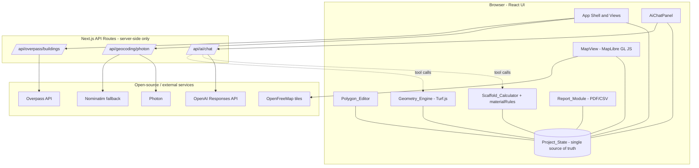

# Design Document

## Overview

StillasCalculator is a responsive web application and installable PWA that estimates scaffolding (stillas) material needs around a building or a selected facade. The user searches for an address, confirms the building on an open-source map, selects or draws the building perimeter, configures a scaffold system and working parameters, and receives a deterministic estimate of bays, levels, and a material list that can be exported to PDF and CSV. An in-app AI Assistant helps the user fill in missing data and trigger calculations, but it performs no arithmetic itself — every quantity originates from deterministic internal functions invoked through tool calls.

The design follows one architectural rule that the rest of the system is organized around:

> **The AI talks. The calculator engine calculates. The report module documents.**

This separation makes the trustworthy parts of the system (geometry measurement and scaffold calculation) pure, deterministic, and independently testable, while isolating the non-deterministic parts (the LLM, network services, map rendering) behind clear boundaries.

### Goals

- Produce repeatable, deterministic estimates: identical inputs always yield identical outputs (Req 9.5).
- Keep all third-party secrets and rate-limited services server-side (Req 3.9, 4.7, 12.6).
- Maintain a single `Project_State` as the source of truth shared by every view (Req 17).
- Work fluidly from a 320px phone to a 1920px desktop, and install as a PWA (Req 1, 16).
- Never present a quantity the model invented — only values returned by the deterministic engine (Req 13.1, 13.6).
- Label every output as a planning estimate requiring professional verification (Req 15).

### Research Summary

The following findings from `mainidea.md` and `deep-research-report.md` directly shape the design:

- **No single free provider covers geocoding + footprints + tiles.** The practical approach is to compose specialized open services: OpenFreeMap (zero-key basemap tiles), Photon (geocoding) with Nominatim as a fallback, and Overpass (live OSM building footprints). OpenFreeMap explicitly provides only tiles — no geocoding, routing, or footprints — which is why those concerns are separate modules.
- **Public Nominatim and Overpass have strict usage policies** (Nominatim max 1 req/sec, no client-side autocomplete; Overpass is not intended as a consumer-app backend). This drives the decision to proxy and rate-limit all geocoding/Overpass traffic through server-side Next.js API routes (Req 3.8, 3.9, 4.7) rather than calling them from the browser.
- **Address points and ML/OSM footprints are approximate.** Footprints can be missing, conflated, or wrong, so a mandatory user-correction step (select / draw / edit polygon) is required rather than optional (Req 5).
- **OpenAI function calling + Structured Outputs** are purpose-built to connect a model to deterministic internal functions and to force schema-conformant JSON. This is the mechanism that lets the AI Assistant orchestrate calculations without performing them (Req 13).
- **Quote-grade, not engineering signoff.** Scaffold quantities are derived from modular, profile-driven rules; tie/anchor counts in particular must be verified manually. This is encoded as a mandatory disclaimer and a manual-verification line item (Req 10.3, 15).

Reference projects (`protakeoff-public` for the takeoff/estimate/export workflow, `andamios-blender` for scaffold BOM logic, `maplibre-geoman` for draw/edit/measure) are used as conceptual models and dependencies, not as forks.

### Technology Stack

| Concern | Technology | Notes |
| --- | --- | --- |
| Framework / SSR / API routes | Next.js (App Router), React, TypeScript | Req 1.6 |
| Styling / responsive | Tailwind CSS | Req 1.6 |
| Map rendering | MapLibre GL JS | Req 2.1 |
| Basemap tiles | OpenFreeMap style URL | Req 2.1; tiles only |
| Geocoding | Photon (primary), Nominatim (fallback) | Req 3; server-side |
| Building footprints | Overpass API | Req 4; server-side |
| Polygon draw/edit | MapLibre Geoman (or equivalent) | Req 5 |
| Geometry math | Turf.js | Req 6 |
| AI Assistant | OpenAI Responses API (function calling + Structured Outputs) | Req 12, 13; server-side key |
| PDF export | Client/server PDF library (e.g. pdf-lib / jsPDF) | Req 14 |
| CSV export | Deterministic CSV serializer | Req 14 |
| PWA | Web app manifest + service worker | Req 16 |

## Architecture

### High-Level Architecture

StillasCalculator is a single Next.js application. The browser hosts the React UI, the map, the polygon editor, and the in-memory `Project_State`. The deterministic engines (geometry, scaffold calculation, material rules, export serialization) run as pure TypeScript modules that can execute on either the client or the server. All access to rate-limited or secret-bearing third-party services is funneled through server-side API routes.



### Layered Responsibilities

The system is organized into five layers with strict dependency direction (UI depends on engines and services; engines depend on nothing app-specific):

1. **Presentation layer** — React components, Tailwind layout, responsive/PWA behavior. Reads from and dispatches updates to `Project_State`. Contains no business arithmetic.
2. **State layer** — a single `Project_State` store (the source of truth) plus a state controller that validates and applies updates and notifies subscribers.
3. **Deterministic engine layer** — `Geometry_Engine`, `Scaffold_Calculator`, `materialRules`, and the export serializers. Pure functions: same input → same output, no I/O, no clock, no randomness.
4. **Service adapter layer** — client-side wrappers (`lib/geocoding`, `lib/osm`, `lib/ai`) that call the server API routes and normalize responses/errors.
5. **Server route layer** — Next.js API routes that hold secrets, enforce rate limits, perform fallback logic, and proxy to external services.

### Why the Engines Are Pure and Client-Capable

The geometry and scaffold engines are pure functions with no dependency on the network or environment. This is what guarantees determinism (Req 9.5) and makes property-based testing meaningful. The AI Assistant's server route reuses these exact same engine functions when handling tool calls, so a quantity computed "by the AI" is byte-for-byte the same quantity the UI computes locally (Req 13.6).

### Request Flow: Address to Estimate

```mermaid
sequenceDiagram
    participant U as User
    participant UI as React UI
    participant API as Next.js API routes
    participant EXT as Photon/Nominatim/Overpass
    participant ENG as Geometry + Scaffold engines

    U->>UI: Type address (>=3 chars, debounce 300ms)
    UI->>API: GET /api/geocoding/photon?q=...
    API->>EXT: Photon query (Nominatim fallback on failure/timeout)
    EXT-->>API: Suggestions
    API-->>UI: Up to 5 suggestions
    U->>UI: Select suggestion
    UI->>API: GET /api/overpass/buildings?lat&lon (r=50m)
    API->>EXT: Overpass query (timeout 25s)
    EXT-->>API: OSM elements
    API-->>UI: GeoJSON building polygons
    U->>UI: Select / draw / edit polygon
    UI->>ENG: measurePolygon(geojson)
    ENG-->>UI: perimeter, area, sides, scaffoldLength
    U->>UI: Choose system + working height
    UI->>ENG: calculateScaffoldMaterials(input)
    ENG-->>UI: bays, levels, materialList, warnings
    UI->>UI: Update Project_State; render material list + summary
```

### Trust Boundaries and Security

- **Secrets**: The OpenAI API key exists only in the server environment and is read only inside `/api/ai/chat` (Req 12.6, 12.7). It is never serialized into client bundles or responses.
- **Rate-limited services**: Photon, Nominatim, and Overpass are reached only from server routes (Req 3.9, 4.7), which apply the per-session debounce/rate limit (Req 3.8) and own the Nominatim fallback decision (Req 3.6).
- **Untrusted responses**: External responses (geocoding, Overpass, OpenAI tool output) are validated/normalized at the adapter or route boundary before entering `Project_State`. Schema-nonconformant AI output is rejected (Req 13.4).
- **No paid/Google services**: Tiles, geocoding, and routing use only the open-source stack (Req 2.5).

## Components and Interfaces

This section defines the major components and the TypeScript interfaces at their boundaries. File paths follow the structure in `mainidea.md`.

### Presentation Components

- `components/layout/AppShell.tsx` — top-level responsive shell. Renders a single-column mobile arrangement with a bottom sheet for secondary panels below 768px, and a multi-pane arrangement at ≥768px (Req 1.2, 1.3). It observes viewport width and switches arrangements while preserving `Project_State` (Req 1.4).
- `components/layout/MobileBottomSheet.tsx` — openable/dismissable bottom sheet hosting secondary panels on mobile (Req 1.2).
- `components/map/MapView.tsx` — wraps MapLibre GL JS with the OpenFreeMap style, zoom/pan controls, marker management, building-polygon layers, full-screen toggle on mobile, and a tile-load error/retry indicator (Req 2).
- `components/map/AddressSearch.tsx` — debounced search input, suggestion list (≤5), selection handling (Req 3).
- `components/map/BuildingFootprintLayer.tsx` — renders nearby footprints and the distinct selected-building style (Req 4.3, 4.8).
- `components/map/PolygonEditor.tsx` — draw/edit/reset perimeter with touch support; enforces ≥3 vertices and non-self-intersection before committing to state (Req 5).
- `components/map/MeasurementPanel.tsx` — live perimeter/area/side lengths, decimal-places control, waste-factor control, facade-subset selection (Req 6).
- `components/scaffold/ScaffoldSystemSelector.tsx` — system list, placeholder notices, editable dimensions (Req 7).
- `components/scaffold/ScaffoldCalculatorForm.tsx` — working height and dimension inputs with validation messages (Req 8).
- `components/scaffold/MaterialList.tsx` — table on desktop, cards on mobile, editable quantities, calculation summary, inline disclaimer (Req 11, 15.1).
- `components/scaffold/ExportButtons.tsx` — triggers PDF/CSV export (Req 14).
- `components/ai/AiChatPanel.tsx`, `AiMessageList.tsx`, `AiInputBox.tsx`, `AiCalculationCard.tsx` — chat UI, in-flight progress/disable, rendering of tool-call results (Req 12).

### State Controller

`lib/state/projectStateController.ts` owns the single `Project_State` and exposes a typed update API. All mutations go through it so that validation (Req 6.11, 7.6, 8.3, 11.6) and propagation (Req 17.2–17.4) are centralized.

```typescript
interface ProjectStateController {
  getState(): ProjectState;
  subscribe(listener: (state: ProjectState) => void): () => void;

  // Each updater validates against field rules and returns a result that
  // either applies the change or reports a validation error while
  // retaining the last valid value (Req 6.11, 7.6, 8.3, 11.6, 17.5).
  setAddress(address: AddressSelection): UpdateResult;
  setPerimeter(polygon: GeoJsonPolygon): UpdateResult;        // validates ring (Req 5.5, 5.7, 5.8)
  setSelectedFacades(sideIndices: number[]): UpdateResult;     // Req 6.7
  setDecimalPlaces(places: number): UpdateResult;              // 0..3 (Req 6.5)
  setWasteFactor(percent: number): UpdateResult;               // 0..100 (Req 6.6, 6.11)
  setScaffoldSystem(systemId: ScaffoldSystemId): UpdateResult; // loads defaults (Req 7.2)
  setDimension(field: DimensionField, value: number): UpdateResult; // Req 7.3, 8.2
  setWorkingHeight(meters: number): UpdateResult;              // 0.01..100 (Req 8.1)
  setMaterialQuantity(itemId: string, qty: number): UpdateResult; // 0..999999 (Req 11.3)
  applyCalculation(result: ScaffoldCalculationOutput): void;   // replaces manual edits (Req 11.7)
}

interface UpdateResult {
  ok: boolean;
  error?: ValidationError; // identifies the invalid field and permitted range
}
```

### Geometry Engine

`lib/geometry/turfMeasurements.ts` — pure functions over GeoJSON polygons using Turf.js.

```typescript
interface PolygonMeasurements {
  perimeterMeters: number;        // Req 6.1
  areaSquareMeters: number;       // Req 6.2
  sideLengthsMeters: number[];    // one entry per polygon side, in ring order (Req 6.3)
  valid: boolean;
}

// Returns measurements for a valid closed ring of >=3 distinct vertices
// with no self-intersecting sides; reports valid:false otherwise (Req 6.10).
function measurePolygon(polygon: GeoJsonPolygon): PolygonMeasurements;

// Validates a ring: closed, >=3 distinct vertices, no self-intersection
// (Req 5.5, 5.7, 5.8, 6.1).
function isValidPerimeter(polygon: GeoJsonPolygon): boolean;

// Scaffold length = sum of selected side lengths, or full perimeter when
// no subset is selected; 0 when the selected subset sums to 0 (Req 6.7, 6.8, 6.9).
function computeScaffoldLength(
  measurements: PolygonMeasurements,
  selectedSideIndices: number[] | null
): number;
```

### Scaffold Calculator and Material Rules

`lib/scaffold/scaffoldCalculator.ts` and `lib/scaffold/materialRules.ts` — the deterministic estimate engine.

```typescript
interface ScaffoldCalculationInput {
  scaffoldLengthMeters: number;   // from Geometry_Engine (Req 6.7-6.9)
  workingHeightMeters: number;    // 0.01..100 (Req 8.1)
  bayLengthMeters: number;        // > 0 (Req 9.x)
  liftHeightMeters: number;       // > 0 (Req 9.x)
  scaffoldWidthMeters: number;
  scaffoldSystemId: ScaffoldSystemId;
  wasteFactorPercent?: number;    // 0..100, default 0 (Req 9.1)
}

interface MaterialItem {
  id: string;
  itemName: string;     // non-empty (Req 10.2)
  quantity: number;     // non-negative integer (Req 10.2)
  unit: string;         // non-empty (Req 10.2)
  notes?: string;       // present only when meaningful (Req 11.1)
}

interface ScaffoldCalculationOutput {
  totalScaffoldLengthMeters: number; // Req 9.6
  numberOfBays: number;              // positive integer (Req 9.2)
  numberOfLevels: number;            // positive integer (Req 9.4)
  materialList: MaterialItem[];      // Req 10
  warnings: string[];                // Req 10.5
}

type CalculationResult =
  | { ok: true; output: ScaffoldCalculationOutput }
  | { ok: false; error: InvalidInputError }; // Req 9.3, 9.7

// Pure and deterministic (Req 9.5). Rejects invalid input without mutating
// any external state (Req 9.3, 9.7).
function calculateScaffoldMaterials(input: ScaffoldCalculationInput): CalculationResult;

// Derives every line item from bays/levels via deterministic rules (Req 10.4).
function buildMaterialList(
  bays: number,
  levels: number,
  systemId: ScaffoldSystemId
): { items: MaterialItem[]; warnings: string[] };
```

#### Core Formulas (Req 9.1, 9.2, 9.4)

```text
wasteFactor      = clamp(wasteFactorPercent ?? 0, 0, 100)
adjustedLength   = scaffoldLengthMeters * (1 + wasteFactor / 100)
numberOfBays     = ceil(adjustedLength / bayLengthMeters)
numberOfLevels   = ceil(workingHeightMeters / liftHeightMeters)
verticalLines    = numberOfBays + 1
```

Validity precondition for a successful calculation (else `InvalidInputError`, Req 9.3, 9.7): `scaffoldLengthMeters > 0`, `bayLengthMeters > 0`, `liftHeightMeters > 0`, `workingHeightMeters > 0`, and all four present.

#### Material Rules (Req 10.1–10.4)

Each rule is a deterministic function of `numberOfBays` (B), `numberOfLevels` (L), and `verticalLines` (V = B + 1). Quantities are non-negative integers. These are quote-grade planning rules, not engineering signoff.

| Component | Unit | Quantity rule |
| --- | --- | --- |
| Frames / standards | pcs | `V * L` |
| Base plates | pcs | `V` |
| Adjustable base jacks | pcs | `V` |
| Ledgers / horizontals | pcs | `B * L * 2` |
| Platforms / decks | pcs | `B * L` |
| Guardrails | pcs | `B * L * 2` |
| Toe boards | pcs | `B * L` |
| Diagonal braces | pcs | `V * L` |
| Ladders / access | pcs | `L` |
| Wall ties / anchors | pcs | `0`, with note: *"Verify manually"* (Req 10.3) |

Every line item is always present in the output, even when a quantity rule lacks an input — in that case the item is included with the derivable quantity (or 0) and a corresponding warning is added (Req 10.5, 10.6). The wall ties/anchors item is always present with its manual-verification note (Req 10.3).

### Scaffold Library

`lib/scaffold/scaffoldSystems.ts` + `data/scaffold-systems.json` define exactly five selectable systems (Req 7.1): Generic Frame, HAKI placeholder, Layher placeholder, Instant/Alufase placeholder, Custom Dimensions. Each provides default `bayLengthMeters`, `scaffoldWidthMeters`, `liftHeightMeters`, and an `isPlaceholder` flag used to show the non-certified notice (Req 7.4).

```typescript
interface ScaffoldSystem {
  id: ScaffoldSystemId;
  displayName: string;
  defaultBayLengthMeters: number;
  defaultScaffoldWidthMeters: number;
  defaultLiftHeightMeters: number;
  isPlaceholder: boolean; // Req 7.4
  isCustom: boolean;      // Req 7.5
}
```

### Service Adapters and Server Routes

```typescript
// lib/geocoding/photon.ts + lib/geocoding/nominatim.ts (client adapters)
// Server route: app/api/geocoding/photon/route.ts
interface GeocodingResult { label: string; lat: number; lon: number; }
// Route returns up to 5 results; performs exactly one Nominatim retry on
// Photon no-result/error/timeout(5s) (Req 3.3, 3.6); rate-limited (Req 3.8).
function geocode(query: string): Promise<GeocodingResult[]>;

// lib/osm/overpass.ts + lib/osm/osmToGeoJSON.ts (client adapters)
// Server route: app/api/overpass/buildings/route.ts
// Queries building ways+relations within 50m, timeout 25s, converts to
// GeoJSON polygons (Req 4.1, 4.2, 4.7).
function fetchBuildings(lat: number, lon: number): Promise<GeoJsonPolygon[]>;

// lib/ai/* (client adapter) + app/api/ai/chat/route.ts (server)
interface AiChatRequest { messages: ChatMessage[]; projectState: ProjectState; }
interface AiChatResponse {
  reply: string;
  toolResults?: ToolResult[];      // deterministic engine outputs (Req 13.1)
  structuredOutput?: unknown;      // schema-validated (Req 13.3, 13.4)
  unavailable?: boolean;           // when no key configured (Req 12.7)
}
```

### AI Assistant Tools

`lib/ai/tools.ts`, `lib/ai/schemas.ts`, `lib/ai/systemPrompt.ts`. The server route exposes the following tool/function definitions to the Responses API (Req 13.2). Each tool maps to deterministic engine code; the model never computes quantities itself (Req 13.1, 13.6). Material lists and report summaries are returned via Structured Outputs conforming to defined JSON Schemas (Req 13.3).

| Tool | Backing deterministic function |
| --- | --- |
| `calculateScaffoldMaterials(input)` | `scaffoldCalculator.calculateScaffoldMaterials` |
| `getSelectedBuildingMeasurements(projectId)` | reads `Project_State` measurements |
| `getAvailableScaffoldSystems()` | reads `Scaffold_Library` |
| `updateWorkingHeight(heightMeters)` | `projectStateController.setWorkingHeight` (validated, Req 12.5) |
| `generateMaterialList(calculationInput)` | `scaffoldCalculator.buildMaterialList` |
| `generateReportSummary(projectId)` | summary serializer over `Project_State` |

### Report Module

`lib/export/pdfExport.ts` and `lib/export/csvExport.ts` are pure serializers over a snapshot of `Project_State` (Req 14). The PDF includes address, perimeter, selected system, the current material-list quantities, an optional AI summary, and the `Verification_Disclaimer` (Req 14.1, 14.3, 14.6, 15.2). The CSV emits one row per item (name, quantity, unit) plus the disclaimer (Req 14.2, 15.3). Both refuse to produce a file when no material list exists (Req 14.4).

## Data Models

### Project_State (single source of truth)

```typescript
interface ProjectState {
  // Address (Req 3, 14.5, 17.1)
  address: AddressSelection | null;

  // Geometry (Req 5, 6, 17.1)
  perimeterPolygon: GeoJsonPolygon | null;
  measurements: PolygonMeasurements | null;
  selectedFacadeSideIndices: number[] | null; // null = whole perimeter (Req 6.8)
  scaffoldLengthMeters: number | null;

  // Display & adjustment settings (Req 6.5, 6.6)
  decimalPlaces: number;   // 0..3, default 2
  wasteFactorPercent: number; // 0..100, default 0

  // Scaffold configuration (Req 7, 8)
  scaffoldSystemId: ScaffoldSystemId | null;
  bayLengthMeters: number | null;
  liftHeightMeters: number | null;
  scaffoldWidthMeters: number | null;
  workingHeightMeters: number | null;

  // Results (Req 9, 10, 11)
  calculation: ScaffoldCalculationOutput | null;
  materialListAdjusted: MaterialItem[] | null; // manual overrides (Req 11.4)

  // AI (Req 12, 14.6)
  aiMessages: ChatMessage[];
  aiSummary: string | null;
}

interface AddressSelection {
  label: string;
  lat: number;
  lon: number;
}

interface GeoJsonPolygon {
  type: 'Polygon';
  coordinates: number[][][]; // [ [ [lon,lat], ... , [lon,lat] ] ] closed ring
}
```

### Field Validation Rules

| Field | Rule | Requirement |
| --- | --- | --- |
| `decimalPlaces` | integer 0..3, default 2 | 6.5 |
| `wasteFactorPercent` | numeric 0..100, default 0 | 6.6, 6.11 |
| `workingHeightMeters` | numeric 0.01..100 | 8.1 |
| `bayLengthMeters` (input) | numeric 0.01..5 | 8.2 |
| `liftHeightMeters` (input) | numeric 0.01..5 | 8.2 |
| `scaffoldWidthMeters` (input) | numeric 0.01..5 | 8.2 |
| dimensions (system editor) | > 0 and ≤ 100 | 7.3 |
| material quantity (manual) | integer 0..999999 | 11.3 |
| perimeter polygon | closed ring, ≥3 distinct vertices, no self-intersection | 5.5, 5.7, 5.8 |

On any invalid value, the controller rejects the change, retains the last valid value, and surfaces a validation message identifying the field and its permitted range (Req 6.11, 7.6, 8.3, 11.6, 17.5).

### Verification Disclaimer (constant)

A fixed string asserting that the output is an estimated planning report requiring professional verification, and that wall ties/anchors must be verified manually (Req 15.4, 15.5). It is shown inline on the material-list view (Req 15.1) and embedded in PDF and CSV exports (Req 15.2, 15.3). Output copy uses planning-estimate terminology and never describes a scaffold as certified, approved, or safe (Req 15.6).

## Correctness Properties

*A property is a characteristic or behavior that should hold true across all valid executions of a system — essentially, a formal statement about what the system should do. Properties serve as the bridge between human-readable specifications and machine-verifiable correctness guarantees.*

These properties apply to the deterministic, pure parts of StillasCalculator: the Geometry Engine, the Scaffold Calculator, the material rules, the field-validation/state layer, the export serializers, and the AI trust boundary (the rule that the assistant only ever surfaces engine-computed quantities). Map rendering, tile loading, MapLibre/Overpass/OpenAI integration, PWA installability, exact timing budgets, and visual layout are covered by example, integration, and smoke tests instead (see Testing Strategy).

The properties below were derived from the prework analysis, with redundant criteria consolidated so each property provides unique validation value.

### Property 1: Polygon measurement correctness

*For any* valid perimeter polygon (a closed ring of at least 3 distinct vertices with no self-intersecting sides), `measurePolygon` returns a non-negative perimeter, a non-negative area, and one side length per polygon edge, where every side length is non-negative and the side lengths sum (within floating-point tolerance) to the perimeter.

**Validates: Requirements 6.1, 6.2, 6.3**

### Property 2: Perimeter validation and normalization

*For any* sequence of vertices: if it forms a valid simple polygon of at least 3 distinct vertices with no self-intersecting sides, then storing it yields a closed GeoJSON ring containing those vertices; otherwise (fewer than 3 vertices, or self-intersecting) the polygon is rejected and nothing is stored in the Project_State.

**Validates: Requirements 5.5, 5.7, 5.8**

### Property 3: Scaffold length aggregation

*For any* valid polygon and any selection of side indices, the computed Scaffold_Length equals the sum of the selected side lengths; when no subset is selected it equals the full perimeter; and when the selected subset is empty (or sums to 0) the Scaffold_Length is 0.

**Validates: Requirements 6.7, 6.8, 6.9**

### Property 4: Invalid polygon is not measured

*For any* invalid polygon, `measurePolygon` reports `valid: false`, no new measurements are produced, and the last valid measurements in the Project_State are retained.

**Validates: Requirements 6.10**

### Property 5: Measurement formatting honors decimal places

*For any* numeric measurement value and any decimal-places setting in the inclusive range 0 to 3, the formatted display string has exactly that many decimal places, and any decimal-places value outside 0 to 3 is rejected in favor of the last valid setting.

**Validates: Requirements 6.5**

### Property 6: Adjusted length formula

*For any* valid calculation input, the adjusted length equals `scaffoldLengthMeters * (1 + clamp(wasteFactorPercent, 0, 100) / 100)`, equals the scaffold length exactly when the waste factor is 0, and is greater than or equal to the scaffold length for any waste factor in 0 to 100.

**Validates: Requirements 9.1**

### Property 7: Number of bays is a correct ceiling division

*For any* valid calculation input, `numberOfBays` is a positive integer equal to `ceil(adjustedLength / bayLengthMeters)`, satisfying `(numberOfBays - 1) * bayLengthMeters < adjustedLength <= numberOfBays * bayLengthMeters`.

**Validates: Requirements 9.2**

### Property 8: Number of levels is a correct ceiling division

*For any* valid calculation input, `numberOfLevels` is a positive integer equal to `ceil(workingHeightMeters / liftHeightMeters)`, satisfying `(numberOfLevels - 1) * liftHeightMeters < workingHeightMeters <= numberOfLevels * liftHeightMeters`.

**Validates: Requirements 9.4**

### Property 9: Invalid calculation inputs are rejected without side effects

*For any* calculation input where `scaffoldLengthMeters <= 0`, `bayLengthMeters <= 0`, or `liftHeightMeters <= 0`, `calculateScaffoldMaterials` returns an invalid-input error identifying the offending value, produces no Material_List, and leaves the Project_State unchanged.

**Validates: Requirements 9.3, 9.7**

### Property 10: Calculation is deterministic

*For any* valid calculation input, invoking `calculateScaffoldMaterials` twice (in any order, any number of times, on any device or session) produces deeply-equal outputs.

**Validates: Requirements 9.5**

### Property 11: Valid calculation output is structurally complete

*For any* valid calculation input, the output contains the total Scaffold_Length in meters, the number of bays, the number of levels, a Material_List, and a warnings array, all with their specified types.

**Validates: Requirements 9.6**

### Property 12: Material list is structurally complete

*For any* completed calculation, the Material_List contains a line item for each of frames/standards, base plates, adjustable base jacks, ledgers/horizontals, platforms/decks, guardrails, toe boards, diagonal braces, and ladders/access, plus a wall ties/anchors item carrying a manual-verification note; and every item has a non-empty name, a non-empty unit, and a quantity that is a non-negative integer.

**Validates: Requirements 10.1, 10.2, 10.3, 10.6**

### Property 13: Material quantities follow the deterministic rules

*For any* number of bays B and levels L (with V = B + 1), each Material_List quantity equals its rule evaluated at (B, L): frames/standards `= V*L`, base plates `= V`, base jacks `= V`, ledgers `= B*L*2`, platforms `= B*L`, guardrails `= B*L*2`, toe boards `= B*L`, diagonal braces `= V*L`, ladders `= L`, wall ties `= 0`.

**Validates: Requirements 10.4**

### Property 14: Field validation is total and atomic

*For any* field with a defined range (waste factor 0–100; working height 0.01–100; bay/lift/width input 0.01–5; system dimensions >0 and ≤100; manual quantity integer 0–999999) and *for any* candidate value, the controller accepts the value if and only if it is numeric and within range (and integer where required); on rejection it retains the last valid value, leaves the rest of the Project_State unchanged, and reports a validation error identifying the field. This rule applies identically whether the value originates from a manual control or an AI tool call.

**Validates: Requirements 6.11, 7.3, 7.6, 8.1, 8.2, 8.3, 11.3, 11.6, 12.5, 17.5**

### Property 15: Selecting a system loads its defaults

*For any* scaffold system in the library, selecting it loads that system's default Bay_Length, Scaffold_Width, and Lift_Height into the Project_State.

**Validates: Requirements 7.2**

### Property 16: Calculation requires all inputs

*For any* calculation request in which Scaffold_Length, Working_Height, Bay_Length, or Lift_Height is missing or unset, no Material_List is produced and every missing value is identified.

**Validates: Requirements 8.4**

### Property 17: New calculation replaces manual quantity adjustments

*For any* prior set of manually adjusted quantities and *for any* new completed calculation, every displayed/stored quantity after the calculation equals the newly computed quantity rather than the prior manual value.

**Validates: Requirements 11.7**

### Property 18: Valid manual quantity adjustment persists

*For any* Material_List item and any integer quantity within 0 to 999999, applying the adjustment results in that exact value being retained in the Project_State and used for display and export.

**Validates: Requirements 11.4**

### Property 19: OSM-to-GeoJSON conversion produces valid polygons

*For any* set of valid OSM building ways/relations, conversion to GeoJSON yields polygon features whose rings are closed and preserve the source vertex coordinates in order.

**Validates: Requirements 4.2**

### Property 20: Building selection is a singleton

*For any* set of building polygons and any sequence of selection taps, exactly one building is selected afterward, and it is the most recently tapped one.

**Validates: Requirements 4.4**

### Property 21: Short queries are gated

*For any* search input string with fewer than 3 characters, the system issues no geocoding request and clears any displayed suggestions.

**Validates: Requirements 3.2**

### Property 22: Suggestions are truncated to five

*For any* provider response containing N suggestions, the displayed list contains exactly `min(5, N)` entries, in order, taken from the front of the response.

**Validates: Requirements 3.3**

### Property 23: Geocoding requests are rate-limited

*For any* sequence of address-input events with timestamps, the spacing between consecutive outbound geocoding requests within a session is never less than 300 milliseconds.

**Validates: Requirements 3.8**

### Property 24: Chat messages are ordered and length-bounded

*For any* sequence of user/assistant messages, the chat panel displays them in chronological order, and *for any* message longer than 2000 characters the send is rejected.

**Validates: Requirements 12.1**

### Property 25: AI presents only engine-computed quantities

*For any* calculation input, every scaffold quantity surfaced by the AI Assistant is exactly equal — with no rounding, scaling, or other transformation — to the value returned by `calculateScaffoldMaterials` for that input, and no quantity is presented that did not originate from a tool-call result.

**Validates: Requirements 13.1, 13.6**

### Property 26: Structured outputs round-trip and nonconforming output is rejected

*For any* generated Material_List or report summary, serializing it as a Structured Output validates against the defined JSON Schema and parses back to an equivalent object; and *for any* output that does not conform to the schema, the AI Assistant rejects it and preserves the existing Project_State.

**Validates: Requirements 13.3, 13.4**

### Property 27: PDF report content inclusion

*For any* Project_State that contains a Material_List, the generated PDF includes the address (whenever an address exists, independent of whether a perimeter was computed), the computed perimeter, the selected scaffold system, every current Material_List item quantity, and the AI-generated summary whenever one exists.

**Validates: Requirements 14.1, 14.5, 14.6**

### Property 28: CSV row fidelity and round-trip

*For any* Material_List, the generated CSV contains exactly one row per item with item-name, quantity, and unit columns, and parsing the CSV back yields the same item name/quantity/unit for every item.

**Validates: Requirements 14.2**

### Property 29: Export refused without a material list

*For any* Project_State that lacks a Material_List, requesting a PDF or CSV export produces no file and surfaces a message that a calculation must be completed first.

**Validates: Requirements 14.4**

### Property 30: Verification disclaimer always present in exports

*For any* exported PDF and *for any* exported CSV, the output contains the Verification_Disclaimer text.

**Validates: Requirements 14.3, 15.2, 15.3**

### Property 31: Outputs never use certification terminology

*For any* exported report and *for any* material-list copy, the forbidden terms describing a scaffold as "certified", "approved", or "safe for use" never appear; planning-estimate terminology is used instead.

**Validates: Requirements 15.6**

### Property 32: Project_State consistency across consumers

*For any* update applied to the Project_State, every consuming view selector (map, calculator, material list, AI assistant, export) returns values deeply-equal to the Project_State, including values that were changed through the AI Assistant.

**Validates: Requirements 17.2, 17.3**

### Property 33: State is invariant under navigation

*For any* Project_State and *for any* sequence of navigations between the map, calculator, and assistant views, the Project_State values are unchanged afterward.

**Validates: Requirements 17.4**

## Error Handling

Error handling follows three principles: (1) external failures never corrupt the Project_State; (2) every rejected input retains the last valid value; and (3) the user always gets an actionable message or fallback.

### Input Validation Errors

All field updates go through the state controller, which validates against the rules in the Data Models section and returns an `UpdateResult`. On failure the prior value is kept and a `ValidationError` identifies the field and permitted range (Req 6.11, 7.6, 8.3, 11.6). This is the atomicity guarantee in Property 14.

### Geometry Errors

Invalid polygons (fewer than 3 vertices, self-intersecting, or otherwise malformed) are rejected by `isValidPerimeter`; the editor blocks completion with a message and the engine retains the last valid measurements (Req 5.7, 5.8, 6.10). See Properties 2 and 4.

### Calculation Errors

`calculateScaffoldMaterials` returns a discriminated `CalculationResult`. Non-positive scaffold length, bay length, or lift height yields `{ ok: false, error }` with no Material_List and no state mutation (Req 9.3, 9.7, Property 9). Missing required inputs are reported with each missing value identified (Req 8.4, Property 16). Partially derivable material rules still return the list, attaching warnings for affected items (Req 10.5, 10.6).

### Network and Service Errors

| Service | Failure handling | Requirement |
| --- | --- | --- |
| Geocoding (Photon) | On no-result, error, or 5s timeout, retry exactly once via Nominatim | 3.6 |
| Geocoding (both) | If both fail, show "no matching address" and preserve current view/marker | 3.7 |
| Map tiles | Show error indication and a retry control | 2.6 |
| Overpass | On network error, non-success, or 25s timeout: error message, offer manual drawing, retain coordinate | 4.5 |
| Overpass | On empty result: offer manual drawing | 4.6 |
| OpenAI | No key configured: non-AI features keep working, show "AI unavailable" | 12.7 |
| OpenAI | Request failure or 30s timeout: error indication, preserve Project_State | 12.8 |
| AI tool output | Schema-nonconformant: reject, error, preserve state | 13.4 |
| AI tool error/missing data | Identify the specific missing value, ask the user, never fabricate | 13.5 |
| Export | PDF/CSV generation failure: error message, preserve Project_State | 14.7 |

### State Update Failures

If applying a Project_State update fails, the controller retains the last valid state and surfaces an error indication (Req 17.5), folded into the atomicity guarantee of Property 14.

## Testing Strategy

StillasCalculator uses a dual testing approach: property-based tests for the deterministic engines and universal rules, and example/integration/smoke tests for UI, external services, configuration, and timing.

### Property-Based Testing

- **Library**: `fast-check`, integrated with the test runner (Vitest or Jest). Property-based testing is not implemented from scratch.
- **Iterations**: Each property test runs a minimum of 100 generated cases.
- **Traceability tag**: Each property test is tagged with a comment in the format
  `// Feature: stillas-calculator, Property {number}: {property_text}`.
- **One test per property**: Each of the 33 correctness properties is implemented by a single property-based test.
- **Generators**:
  - Valid simple polygons (random convex/star-shaped rings and known shapes such as axis-aligned rectangles where perimeter/area are analytically checkable), plus deliberately invalid rings (degenerate, <3 vertices, self-intersecting) for Properties 1–4.
  - Calculation inputs spanning valid ranges and boundary/invalid values (0, negative, non-numeric, range extremes) for Properties 6–11, 14, 16.
  - Bay/level pairs for the material-rule property (Property 13) and material lists for export properties (Properties 27–31).
  - OSM element fixtures (ways and relations, with and without tags/attributes) for Property 19.
  - Event sequences with timestamps for the rate-limit and ordering properties (Properties 23, 24).
- **Engine reuse**: Because the AI server route calls the same engine functions, Property 25 (AI presents only engine-computed quantities) compares assistant-surfaced values directly against `calculateScaffoldMaterials` output.

### Unit and Example Tests

Used for specific behaviors and edge cases that are not universal: marker singleton behavior (Req 2.3, 3.5), debounce timing (Req 3.1), Nominatim fallback count (Req 3.6), error/empty branches (Req 3.7, 4.5, 4.6), placeholder notices (Req 7.4), missing-dimension messaging (Req 7.5), warning generation (Req 10.5), in-flight chat disabling (Req 12.3), tool-call state update (Req 12.4), AI degradation/timeout (Req 12.7, 12.8), tool-missing-data prompting (Req 13.5), and export failure (Req 14.7). Unit tests are kept focused — the property tests carry the burden of broad input coverage.

### Integration Tests

Used for external-service wiring where behavior does not vary meaningfully with input: MapLibre + OpenFreeMap initialization (Req 2.1), Overpass query construction and round-trip with 1–3 representative responses (Req 4.1), and the OpenAI Responses API call path (Req 12.2). These run with mocked or recorded responses to keep them cheap and deterministic.

### Smoke and Configuration Tests

Single-execution checks for one-time setup: stack/build configuration (Req 1.6), absence of Google/paid map dependencies (Req 2.5), server-side-only routing of geocoding/Overpass (Req 3.9, 4.7), OpenAI key never present in the client bundle (Req 12.6), the six AI tool definitions being registered (Req 13.2), the single Project_State instance (Req 17.1), and the PWA manifest fields (Req 16.1).

### Responsive, Accessibility, and PWA Tests

Component/snapshot tests at representative breakpoints (320, 375, 768, 1920) for layout rules (Req 1.1–1.5, 11.2, 16.3), touch-target sizing ≥ 44×44 CSS px (Req 16.4), PWA installability via a Lighthouse/installability check over HTTPS (Req 16.2), and graceful degradation when PWA install is unsupported (Req 16.5). Full WCAG validation additionally requires manual testing with assistive technologies and expert accessibility review, which is out of scope for automated tests.
