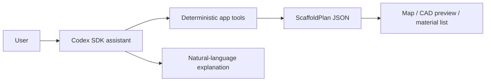
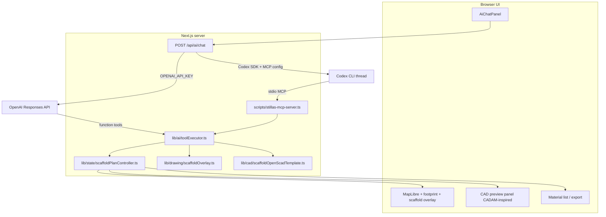

# Codex SDK Mandatory Tools + ScaffoldPlan + CAD Pipeline

## What you want (confirmed)

You want the in-app AI to **control the app**, not just chat:



Hard rules you specified:

- **No optional fallback** for calculations or drawings — every action goes through tools.
- **No invented quantities** — only [`lib/scaffold/scaffoldCalculator.ts`](lib/scaffold/scaffoldCalculator.ts), [`lib/scaffold/materialRules.ts`](lib/scaffold/materialRules.ts), and the geometry engine.
- **ScaffoldPlan** is the single source of truth (replacing/evolving today’s [`ProjectState`](lib/types.ts)).
- **Phased drawing**: 2D scaffold plan first → CADAM-style CAD export → Cesium/Pascal later.

## Current gap

Today the Codex path is text-only:

```289:296:app/api/ai/chat/route.ts
  if (!useOpenAiSdk && providerPreference !== 'openai-api') {
    const codexResult = await runCodexSdkChat(
      messages,
      body.projectState ?? projectStateController.getState(),
    );
    if (codexResult.ok) {
      return NextResponse.json({ reply: codexResult.reply, toolResults: [] });
```

[`lib/ai/codexSdkAdapter.ts`](lib/ai/codexSdkAdapter.ts) runs a single `thread.run()` with `sandboxMode: 'read-only'`, embeds a JSON snapshot in the prompt, and **never registers or executes the six app tools** defined in [`lib/ai/tools.ts`](lib/ai/tools.ts). The OpenAI API key path already has the correct tool-dispatch loop in [`app/api/ai/chat/route.ts`](app/api/ai/chat/route.ts).

The app is **2D MapLibre + GeoJSON footprint** today — no CADAM, Cesium, or Pascal code exists yet.

---

## Target architecture



**Key design choice:** one shared `toolExecutor` implements every tool once. Codex reaches it through an **MCP server** (Codex-native; `@openai/codex-sdk` already surfaces `mcp_tool_call` events). The OpenAI API path keeps native function tools but calls the same executor.

---

## Phase 1 — ScaffoldPlan + mandatory Codex tools

### 1.1 Introduce `ScaffoldPlan` as source of truth

Add [`lib/scaffold/scaffoldPlan.ts`](lib/scaffold/scaffoldPlan.ts) and extend [`lib/types.ts`](lib/types.ts):

```typescript
interface ScaffoldPlan {
  // Existing ProjectState fields (address, polygon, measurements, scaffold config, calculation, AI messages)
  version: number;
  drawing: {
    overlayGeoJson: FeatureCollection | null;  // 2D bays/facade layout on map
    lastGeneratedAt: number | null;
  };
  cad: {
    openScadSource: string | null;             // deterministic template output
    parameters: Record<string, number>;        // bayLength, levels, width, etc.
    exports: { format: 'scad' | 'stl' | 'dxf'; pathOrUrl: string }[];
    lastGeneratedAt: number | null;
  };
}
```

Refactor [`lib/state/projectStateController.ts`](lib/state/projectStateController.ts) → **`scaffoldPlanController`**: same validated updaters (`setPerimeter`, `setSelectedFacades`, `setWorkingHeight`, `applyCalculation`, …), now reading/writing `ScaffoldPlan`. Keep selector projections for map/calculator/export/AI so UI churn stays minimal.

### 1.2 Extract shared tool executor

Create [`lib/ai/toolExecutor.ts`](lib/ai/toolExecutor.ts):

- Move dispatch logic from [`lib/ai/tools.ts`](lib/ai/tools.ts) + chat route into one module.
- Every tool mutates `scaffoldPlanController` and returns structured JSON.
- Existing six tools stay; signatures unchanged for backward compatibility.

**New mandatory control tools** (Phase 1):

| Tool | Purpose |
|------|---------|
| `getScaffoldPlan` | Full plan snapshot for the model |
| `setBuildingPerimeter` | Validated polygon update (wraps `setPerimeter`) |
| `selectFacadeSides` | Facade subset (wraps `setSelectedFacades`) |
| `setScaffoldSystem` | System + default dimensions |
| `setScaffoldDimensions` | Bay/lift/width updates |

Drawing/CAD tools come in Phases 2–3 but are **declared now** so the assistant never improvises.

### 1.3 MCP server for Codex (mandatory tool path)

Add [`scripts/stillas-mcp-server.ts`](scripts/stillas-mcp-server.ts) using `@modelcontextprotocol/sdk`:

- stdio transport, registers the same tool names/schemas as [`lib/ai/schemas.ts`](lib/ai/schemas.ts).
- Receives `STILLAS_PLAN_FILE` (temp JSON path) + `STILLAS_SESSION_ID` via env on each chat request.
- On each tool call: load plan → `toolExecutor` → write updated plan back to file.
- Chat route reads the file after the Codex turn and merges into `scaffoldPlanController`.

Replace [`runCodexSdkChat`](lib/ai/codexSdkAdapter.ts) with [`lib/ai/codexAgentRunner.ts`](lib/ai/codexAgentRunner.ts):

- Use `runStreamed()` (not plain `run()`) to observe `mcp_tool_call` completion events.
- Pass MCP server config via Codex `config` overrides (verify exact TOML keys against installed Codex CLI during implementation).
- Set `approvalPolicy: 'never'` + auto-accept for the in-app MCP server only.
- Increase timeout budget for multi-tool turns (`STILLAS_CODEX_TIMEOUT_MS`).

### 1.4 Unify chat route + enforce mandatory tools

Update [`app/api/ai/chat/route.ts`](app/api/ai/chat/route.ts):

1. Serialize current `ScaffoldPlan` to a temp file before any AI turn.
2. **Codex path**: run MCP-enabled agent; collect `toolResults` from MCP events + updated plan file.
3. **OpenAI path**: existing Responses loop, but call shared `toolExecutor` (no duplicate logic).
4. Return `{ reply, toolResults, scaffoldPlan, structuredOutput }` so the client syncs UI.

Update [`lib/ai/systemPrompt.ts`](lib/ai/systemPrompt.ts):

- Explicit rule: **any calculation, drawing, export, facade change, or material list MUST use a tool call first**.
- If the user asks for an action and required inputs exist, the model must call tools before replying with numbers.
- Optional server-side guard: if the user message matches action intent (calculate/draw/export) and `toolResults` is empty, return a retry hint to the model (one retry max within timeout).

Update [`lib/ai/chatClient.ts`](lib/ai/chatClient.ts) + [`components/StillasCalculatorApp.tsx`](components/StillasCalculatorApp.tsx): on chat response, apply returned `scaffoldPlan` to controller so map/material list update without manual refresh.

### 1.5 Provider policy

- **`STILLAS_AI_PROVIDER=codex-cli`**: Codex + MCP tools only (your primary mode).
- **`auto` with API key**: OpenAI Responses + same tools (unchanged billing path).
- Remove the silent “Codex text-only with empty `toolResults`” behavior entirely.

---

## Phase 2 — 2D scaffold drawing on the map

Add [`lib/drawing/scaffoldOverlay.ts`](lib/drawing/scaffoldOverlay.ts):

- Input: `ScaffoldPlan` + calculation output from deterministic engine.
- Output: GeoJSON `FeatureCollection` — facade run polyline, bay tick marks, level bands, scaffold envelope offset from footprint (using existing side lengths + bay count from calculator, not AI math).

New tools:

| Tool | Purpose |
|------|---------|
| `generateScaffoldDrawing` | Runs overlay engine, stores in `plan.drawing.overlayGeoJson` |
| `clearScaffoldDrawing` | Resets drawing layer |

UI:

- [`components/map/ScaffoldOverlayLayer.tsx`](components/map/ScaffoldOverlayLayer.tsx) — MapLibre layer subscribed to `scaffoldPlanController`.
- Extend [`components/ai/AiChatPanel.tsx`](components/ai/AiChatPanel.tsx) to show tool-action cards when drawing tools run.

Workflow example:

> User: “Draw scaffold on the north and east facades”  
> → Codex calls `selectFacadeSides` → `calculateScaffoldMaterials` → `generateScaffoldDrawing`  
> → map updates → assistant explains bays/levels from tool output.

---

## Phase 3 — CADAM-inspired CAD export (deterministic, not LLM geometry)

**Reference:** [Adam-CAD/CADAM](https://github.com/Adam-CAD/CADAM) for UX patterns (browser preview, parametric sliders, export buttons) — **do not fork the full app**. CADAM uses Claude to *generate* OpenSCAD; StillasCalculator will **template-generate** OpenSCAD from `ScaffoldPlan` so geometry stays deterministic.

Add [`lib/cad/scaffoldOpenScadTemplate.ts`](lib/cad/scaffoldOpenScadTemplate.ts):

- Pure function: `ScaffoldPlan` → OpenSCAD string (frame bays, standards, ledger lines, base plates) using calculator outputs as parameters.
- Parameter map mirrors CADAM’s slider model (`bayLength`, `numBays`, `numLevels`, `scaffoldWidth`, `workingHeight`).

Export pipeline [`lib/cad/cadExportService.ts`](lib/cad/cadExportService.ts):

- **`.scad`**: write template directly (always available).
- **`.stl` / `.dxf`**: compile via `openscad` CLI on server if installed, **or** browser-side `openscad-wasm` in preview panel (note: WASM bundle is **GPL** — keep it client-side with license notice, same as CADAM’s approach).
- Store export metadata in `plan.cad.exports`; serve downloads via [`app/api/cad/export/route.ts`](app/api/cad/export/route.ts).

New tools:

| Tool | Purpose |
|------|---------|
| `generateCadModel` | Build OpenSCAD from ScaffoldPlan, store in `plan.cad` |
| `exportCadFormat` | Produce `scad` / `stl` / `dxf` and return download URL |

UI: [`components/cad/CadPreviewPanel.tsx`](components/cad/CadPreviewPanel.tsx) — Three.js/React Three Fiber preview of compiled mesh (CADAM-style panel beside map).

---

## Phase 4 (later) — Cesium 3D Tiles

Deferred per your direction. When ready:

- Add optional Cesium viewer tab extruding footprint + scaffold mesh in geospatial context.
- Tool: `renderGeospatialPreview` — no change to ScaffoldPlan calculation path.
- Reference: [CesiumGS/3d-tiles](https://github.com/CesiumGS/3d-tiles) for tile serving if needed.

## Phase 5 (later) — Pascal architectural editor

Deferred. Only if full BIM-style walls/floors are required beyond scaffold planning.

---

## Testing strategy

| Area | Tests |
|------|-------|
| ScaffoldPlan | Round-trip serialize, controller validation parity with current `ProjectState` tests |
| toolExecutor | Each tool returns engine-identical numbers to existing [`lib/ai/tools.ts`](lib/ai/tools.ts) tests |
| MCP server | Integration test: spawn server, call `calculateScaffoldMaterials`, verify plan file mutation |
| Codex runner | Mock streamed MCP events → assert `toolResults` populated |
| Drawing | Golden GeoJSON for a rectangular footprint + known bay count |
| CAD template | Snapshot test: fixed ScaffoldPlan → expected OpenSCAD string |

---

## Files most affected

| Action | Path |
|--------|------|
| New | `lib/scaffold/scaffoldPlan.ts`, `lib/state/scaffoldPlanController.ts`, `lib/ai/toolExecutor.ts`, `lib/ai/codexAgentRunner.ts`, `scripts/stillas-mcp-server.ts`, `lib/drawing/scaffoldOverlay.ts`, `lib/cad/scaffoldOpenScadTemplate.ts`, `lib/cad/cadExportService.ts`, `components/map/ScaffoldOverlayLayer.tsx`, `components/cad/CadPreviewPanel.tsx`, `app/api/cad/export/route.ts` |
| Refactor | `lib/types.ts`, `lib/ai/tools.ts`, `lib/ai/codexSdkAdapter.ts`, `lib/ai/systemPrompt.ts`, `app/api/ai/chat/route.ts`, `components/StillasCalculatorApp.tsx`, `lib/ai/chatClient.ts` |
| Docs | `docs/codex-ai-auth.md` — document MCP server setup + mandatory tool policy |

---

## Risks and mitigations

| Risk | Mitigation |
|------|------------|
| Codex MCP config format differs by CLI version | Pin `@openai/codex-sdk` / Codex CLI; add smoke test in CI |
| MCP server cannot see in-memory controller | Per-request temp plan file + session ID (designed above) |
| GPL from openscad-wasm | Client-side only + license notice; server uses CLI OpenSCAD if available |
| Multi-tool turns exceed 28s timeout | Raise `STILLAS_CODEX_TIMEOUT_MS`; cap iterations; stream progress to UI |
| Windows MCP spawn | Use `node scripts/stillas-mcp-server.ts` with `.cmd` shim like existing Codex CLI discovery |

---

## Success criteria

1. With `STILLAS_AI_PROVIDER=codex-cli`, asking “calculate materials for this house” always produces non-empty `toolResults` and updates material list from engine output.
2. Asking “draw scaffold on selected facades” runs drawing tools and shows overlay on MapLibre.
3. Asking “export CAD” runs `generateCadModel` + `exportCadFormat` and downloads `.scad`/`.stl`/`.dxf` derived from ScaffoldPlan — never from model-invented dimensions.
4. OpenAI API key path uses the same tool executor and ScaffoldPlan — no behavioral fork.
