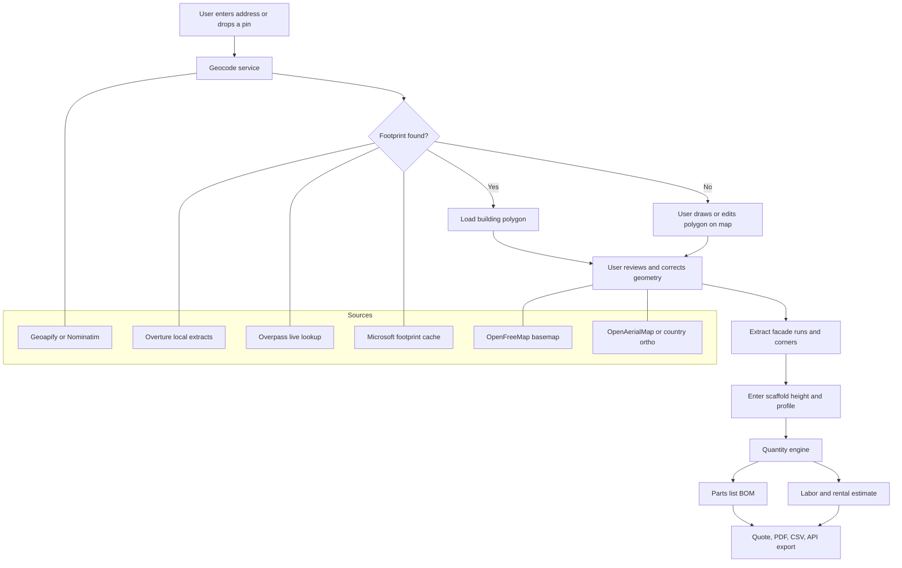

# Open Source Research for a Scaffolding Calculator App

## Executive summary

Among the GitHub projects I vetted, there is only one clearly scaffold-specific project with current visible activity: **andamios-blender**, a Blender add-on for parametric scaffold design, structural checking, and CAD output. The strongest adjacent projects are **protakeoff-public** for contractor takeoff and estimating workflows, **maplibre-gl-measures** for lightweight map-based measurement, and **maplibre-geoman** for richer draw/edit/measure interactions. Broader estimating platforms such as **ConstructionCostEstimator** and **OpenConstructionERP** are useful references for pricing, BOQ, and workflow design, but they are more generic and come with stronger copyleft obligations or much larger scope. citeturn8view0turn13view2turn8view2turn12view2turn13view0turn8view6turn12view7turn25view0turn26view0

For free, Google-free geodata, there is no single service that cleanly covers **address lookup, building footprints, orthophoto imagery, tiles, and production-friendly usage terms** at once. The most practical stack is to combine **Overture Maps** or **Microsoft Global ML Building Footprints** for automatic footprint extraction, **Overpass API** for live OSM polygon lookup, **Geoapify** or low-volume **Nominatim** for geocoding, **OpenFreeMap** for zero-key basemaps, and **OpenAerialMap** or country-specific orthophoto services for imagery. Public **Nominatim** and **Overpass** are suitable for prototypes and low-volume end-user traffic, but both official policies make clear that heavy or generic app-backend use should be cached, proxied, or self-hosted. citeturn36view4turn36view2turn36view3turn36view0turn36view6turn36view7turn37view0turn32view1turn32view2turn32view4

The best product strategy is a **web-first, quote-grade estimator** rather than an engineering-signoff tool: use a **React + TypeScript + MapLibre** frontend, a **Python/FastAPI** quantity engine to reuse Python scaffold logic from andamios-blender, and a **user-correctable geometry workflow** because address points are approximate, ML footprints can miss or conflate buildings, and free imagery coverage is uneven. In practice, the most promising fork shortlist is **protakeoff-public** for the quote shell, **andamios-blender** for scaffold-specific BOM and structural logic, and **maplibre-gl-measures** for manual measurement UX. citeturn30search1turn8view0turn14view0turn8view2turn18view1turn13view0turn36view2turn36view3turn39view0

## Assumptions and evaluation criteria

The prompt leaves three important design variables open. I therefore assume a **web-first MVP** that can later be wrapped for desktop or mobile, **quote-grade accuracy** rather than legal/engineering certification, and a **hard constraint against paid Google APIs**. That combination pushes the design toward open map data, user correction tools, and a calculation engine that is explicit about uncertainty.

I evaluated candidates on six dimensions: how close they are to scaffolding or quantity takeoff, how reusable their code looks from the public file tree, whether the license is permissive enough for a commercial fork, whether the project shows recent visible activity, whether it already solves map-based measurement or geometry editing, and whether it reduces dependence on fragile public endpoints. Where GitHub’s rendered HTML did not expose an exact latest-commit timestamp, I used the most recent visible release or other visible activity.

## GitHub repositories

The repository set breaks into three groups: a scaffold-specific engineering codebase, estimator/takeoff products, and map measurement libraries. The first group is very small right now; the second and third groups are much richer and are the most realistic starting points for an MVP.

| Repository | What it gives you | Stack, license, last visible activity | Key files or modules to reuse | Adaptation effort and limitations |
|---|---|---|---|---|
| **andamios-blender** citeturn8view0turn20search0 | Parametric scaffold design, structural checking to EN 1993-1-1 and EN 12811-1, and CAD plan export. This is the most directly relevant scaffold-specific OSS project I found. citeturn8view0 | Primary language: **Python 91.3%**. License: **MIT**. Latest visible release: **v0.7.16 on 2026-05-04**. citeturn13view2 | `andamios_addon.py`, `calc/bom.py`, `calc/model.py`, `calc/solver.py`, `calc/report.py`, `calc/checks/`, `cad_plan.py`, `cad_views.py`, `validator.py`. citeturn9view4turn14view0 | **High** adaptation effort. The logic is valuable, but the UX is Blender-centric, the repo is Spanish-first, and it is oriented toward engineering/CAD rather than a lighter quoting app. citeturn8view0turn9view4 |
| **protakeoff-public** citeturn8view2 | A contractor estimating tool with digital takeoffs, marked-up drawings, and reusable formula-driven templates. It is the best reusable estimating shell among the modern, permissively licensed candidates. citeturn8view2turn18view1 | Primary language: **TypeScript 84.4%** with **Rust** backend pieces. License: **MIT**. Tech stack: React 19, TypeScript, Tailwind, Rust/Tauri, SQLite. Visible activity includes a GitHub result showing the latest commit about four months before 2026-05-29 and issue activity on **2026-03-16**. citeturn12view2turn20search2turn20search8 | `frontend/src`, `frontend/src-tauri`, `wasm/src`, `schemas/schema.fbs`, `schemas/schema.sql`, and `templates_rows.json`, which already contains formula-driven assemblies and quantity formulas. citeturn17view0turn15view0turn18view0turn18view1 | **Medium** adaptation effort. It is not scaffold-specific, it is desktop/Tauri-oriented rather than map-first, and the public repo is still small, but it already has the right mental model for quantity templates and priced takeoffs. citeturn12view2turn17view0turn18view1 |
| **maplibre-gl-measures** citeturn8view5 | A focused MapLibre GL JS control for measuring line lengths and polygon areas. This is the cleanest low-friction manual measurement component. citeturn8view5 | Primary language: **JavaScript 89.3%**. License: **MIT**. Latest visible release: **0.0.20 on 2026-01-05**. citeturn13view0 | `src/maplibre-gl-measures.js`, `src/convert-units.js`, `src/maplibre-gl-measures.d.ts`, and the bundled tests. citeturn16view0turn12view0 | **Low** adaptation effort. Limitation: it solves measurement well, but it does not provide geocoding, footprint retrieval, persistence, or estimation logic on its own. citeturn8view5turn16view0 |
| **maplibre-geoman** citeturn8view6 | A more feature-rich MapLibre plugin for drawing, editing, snapping, measuring, and geometry manipulation. Better than a pure measure control if you need editable footprints and user correction. citeturn8view6 | Primary language: **TypeScript 92.6%**. License: **MIT**. Latest visible release: **v0.7.1 on 2026-03-06**; issues show active public discussion in early 2026. citeturn12view1turn12view7turn21search5 | `packages/core`, `packages/maplibre`, `packages/mapbox`, `ARCHITECTURE.md`, test suites, and the dev app. citeturn16view1turn9view3 | **Low to medium** adaptation effort. Limitation: Geoman also sells a Pro tier, and its public site positions some advanced features as commercial, so you should verify the exact free-vs-pro boundary before committing to it as your primary editor. citeturn12view7turn21search9 |
| **ConstructionCostEstimator** citeturn25view0 | A modern web estimator for project costs, risk, sharing, reporting, and admin workflows. Best used as a product-workflow reference rather than a geometry engine. citeturn25view0 | Primary language: **TypeScript 99.5%**. License: **GPL-3.0**. GitHub Topics showed it updated four days before 2026-05-29, which corresponds to roughly **2026-05-25**. citeturn25view0turn24search14 | `src`, `supabase/functions`, `public`, and the costing/risk/reporting flows in the React app. citeturn25view0 | **Medium** adaptation effort. Limitation: generic cost-estimation focus, no map measurement stack, and GPL obligations if you fork and distribute modified versions. citeturn25view0 |
| **OpenConstructionERP** citeturn26view0 | A broad open construction platform that already covers BOQ, PDF/CAD/BIM takeoff, dashboards, and data pipelines. It is the strongest “maximum feature breadth” reference. citeturn26view0turn27view0 | Mixed stack: **TypeScript 47.3%**, **Python 42.4%**. License: **AGPL-3.0**. Latest visible release: **v5.2.7 on 2026-05-27**. citeturn26view0 | `backend`, `frontend`, `data`, `modules`, `desktop`, `docs`, and packaged quickstart/install flows. citeturn27view0 | **High** adaptation effort. Limitation: very broad scope for a scaffolding calculator, AGPL obligations for network deployment, and more surface area than an MVP needs. citeturn26view0 |

The most reusable **permissive** options are therefore the MIT set: **andamios-blender**, **protakeoff-public**, **maplibre-gl-measures**, and **maplibre-geoman**. If your team later decides to build on **Leaflet** instead of **MapLibre**, the mature sibling project **Leaflet-Geoman** is also MIT-licensed and had a latest visible release of **2.19.3 on 2026-04-10**. citeturn13view2turn8view2turn13view0turn12view7turn12view6turn13view5

## Free map and geometry APIs

For this app, “map API” really means three separate concerns: **geocoding**, **building geometry**, and **tiles/imagery**. The strongest free stack is a combination, not a single vendor.

| API or data source | Best use | Free tier or practical limit | Data available | Usage terms and example endpoint |
|---|---|---|---|---|
| **Overture Maps** citeturn36view4turn36view2turn36view3 | Automatic building footprints and address seeding through downloadable open data. Best “automatic dimensions” source if you are willing to host local extracts. | No per-request free tier in the usual SaaS sense; the official quickstart shows direct download by area of interest from cloud-hosted GeoParquet. citeturn36view4 | Buildings theme with conflated footprints and stable GERS IDs; addresses theme with **446M+** address points, though address geometry is an approximate point, not a full footprint. citeturn36view2turn36view3 | Buildings are **ODbL**; addresses come from permissive source licenses with attribution requirements that vary by source. Example: `overturemaps download --bbox=-71.068,42.353,-71.058,42.363 -f geojson --type=building -o buildings.geojson`. citeturn36view2turn36view4turn36view5 |
| **Overpass API** citeturn36view6turn36view7 | Live building-footprint lookup from OSM after geocoding or map click. Best for on-demand, small-area polygon retrieval. | The main public instance says you can safely assume you do not disturb others if you stay under **10,000 queries/day** and **1 GB/day**; the public instances are explicitly not intended as the backend for a larger consumer app. citeturn36view6turn36view7 | Raw OSM elements, tags, and geometries, including `way["building"]` and related relations. citeturn36view6 | Public instance usage is for small-scale use; heavy users should self-host. Example base endpoint: `https://overpass-api.de/api/interpreter`. citeturn36view6turn36view7 |
| **Nominatim** citeturn32view3turn37view0turn37view1turn37view2 | Address-to-coordinate lookup and reverse geocoding. Best for prototyping and low-volume traffic, or as a self-hosted stack. | Public OSMF policy sets an absolute maximum of **1 request/second**, forbids heavy use and client-side autocomplete, and requires attribution plus valid app identification. citeturn37view0 | `/search`, `/reverse`, `/lookup`, `/status`, and related OSM object search. Best used to locate a building, then paired with Overpass for the polygon. citeturn37view1turn37view2 | ODbL attribution applies; proxying/caching is recommended; generic geocoding services on top of the public endpoint are forbidden. Example: `https://nominatim.openstreetmap.org/search?q=Rua+Augusta+Lisbon&format=geocodejson&limit=1`. citeturn37view0turn37view1 |
| **Microsoft Global ML Building Footprints** citeturn36view0 | Large-scale offline building footprint coverage and periodic refreshes. Best fallback when OSM coverage is weak. | No online request tier; this is a downloadable global dataset. citeturn36view0 | **1.4B** building footprints worldwide, with ongoing updates and some released **height estimates** in recent updates. citeturn36view0 | License: **CDLA Permissive 2.0**. The repo points to downloadable datasets through `dataset-links.csv`. citeturn36view0 |
| **OpenAerialMap** citeturn32view4turn39view1turn39view0turn39view2 | Finding open orthophoto or aerial imagery sources and corresponding tile services. Best as an imagery discovery layer, not a universal basemap. | The docs expose public API endpoints but do not publish a clear free-tier quota. HOTOSM documentation also notes ongoing funding and maintenance needs. citeturn32view4turn39view0 | Imagery metadata, map-layer listings, analytics, and a modern STAC-backed revamp roadmap. citeturn32view4turn39view1turn39view2 | Example endpoints: `/meta`, `/tms`, `/analytics`, with `http://api.openaerialmap.org/meta` shown in the docs. citeturn32view4 |
| **Geoapify** citeturn32view1turn38view0turn38view1turn38view2 | Production-friendlier geocoding, reverse geocoding, autocomplete, postcode, boundaries, and tiles without Google. Best geocoder for a commercial MVP that still wants a free plan. | Free plan: **3,000 credits/day**, **up to 5 requests/second**, and **limited commercial use**. Geocoding requests are free-plan eligible; map tiles cost **0.25 credits/request**. citeturn32view1turn38view0turn38view2 | Geocoding, reverse, autocomplete, postcode geometry, boundaries, map tiles, and static maps. citeturn38view1 | API key required. Example geocoding endpoint: `https://api.geoapify.com/v1/geocode/search?text=11%20Av.%20de%20la%20Bourdonnais%2C%2075007%20Paris%2C%20France&format=json&apiKey=YOUR_API_KEY`. citeturn38view0 |
| **OpenFreeMap** citeturn32view2turn40view0 | Free base tiles for MapLibre, Leaflet, or OpenLayers. Best zero-key basemap for measurement UI. | The public instance says it is **completely free with no limits on map views or requests**, and needs no registration or API key. citeturn32view2 | Styled vector basemaps based on OpenStreetMap/OpenMapTiles. No geocoding or building footprint API. citeturn32view2turn40view0 | Best used as the base-map layer only. Example style URL: `https://tiles.openfreemap.org/styles/liberty`. citeturn40view0 |

Representative endpoint patterns from the official docs are below. These are the most useful examples for an MVP because they cover geocoding, footprint lookup, tiles, and imagery discovery. citeturn36view6turn37view1turn38view0turn32view4turn40view0

```text
# Overpass: nearest building polygon around a coordinate
https://overpass-api.de/api/interpreter?data=[out:json];way["building"](around:20,40.7484,-73.9857);out geom;

# Nominatim: forward geocode
https://nominatim.openstreetmap.org/search?q=Rua+Augusta+Lisbon&format=geocodejson&limit=1

# Geoapify: forward geocode
https://api.geoapify.com/v1/geocode/search?text=11%20Av.%20de%20la%20Bourdonnais%2C%2075007%20Paris%2C%20France&format=json&apiKey=YOUR_API_KEY

# OpenFreeMap: basemap style for MapLibre
https://tiles.openfreemap.org/styles/liberty

# OpenAerialMap: imagery metadata
http://api.openaerialmap.org/meta
```

The practical conclusion is straightforward. **Overture** is the best automatic geometry source if you are willing to preprocess data locally; **Overpass** is the best live footprint query for small requests; **Geoapify** is the best “production-friendly free tier” geocoder; **Nominatim** is the best pure-open fallback for low volume or self-hosted use; **OpenFreeMap** is the best zero-key basemap; and **OpenAerialMap** is useful as an imagery catalog, but not strong enough to be your only global imagery strategy. citeturn36view4turn36view2turn36view6turn32view1turn37view0turn32view2turn32view4

## Recommended architecture and estimation logic

A strong default architecture is **React + TypeScript + MapLibre GL JS** on the frontend, **FastAPI + Python** on the backend, and a geometry cache backed by **PostGIS** in multi-user deployments or **SQLite/GeoJSON** for a lighter self-hosted version. MapLibre is explicitly built as a TypeScript library for rendering vector-tile maps, OpenFreeMap provides a zero-key MapLibre style URL, and the two best-fit editing controls are maplibre-gl-measures for simple measurement and maplibre-geoman for richer geometry editing. That frontend stack also keeps you aligned with the most reusable open-source measurement components. citeturn30search1turn40view0turn13view0turn12view7

The backend should own three responsibilities: a **geocoder/geometry adapter layer**, a **scaffold quantity engine**, and a **caching/compliance layer**. That backend is where Python becomes attractive, because the most scaffold-specific reusable code you can mine right now is Python-based andamios-blender, while public Nominatim and Overpass usage policies strongly favor caching, request shaping, and the option to swap providers later. In production, the cleanest pattern is to query local Overture or Microsoft extracts first, then use Overpass/Nominatim only as low-volume online fallbacks. citeturn14view0turn37view0turn36view7turn36view4turn36view0

A reliable dimension-acquisition flow should work in this order. First, geocode the address with **Geoapify** or low-volume **Nominatim**. Second, locate a building footprint from your local **Overture** slice or live **Overpass**. Third, if the footprint is poor or missing, fall back to your local **Microsoft** footprint dataset. Fourth, always let the user correct the footprint manually on the map, because Overture address geometry is only an approximate point and Overture’s own building conflation process intentionally filters out likely-invalid small ML features, which can also remove some valid structures. Fifth, ask the user for scaffold height and any non-visible site constraints, because footprints solve plan dimensions far better than elevation. citeturn38view0turn37view0turn36view4turn36view6turn36view0turn36view3turn36view2

Defaults in the quantity engine should come from a **system profile** rather than hard-coded constants, because scaffold dimensions are modular and safety validation depends on local standards and manufacturer rules. OSHA’s scaffold rules include the well-known **4:1** tie/bracing trigger and platform-width requirements, while Layher’s catalog family shows that bay-length choices are discrete modular sizes rather than arbitrary continuous values. citeturn41search0turn41search3turn41search10

| Required input | Why it matters | Suggested treatment in the app |
|---|---|---|
| Building footprint or user-traced perimeter | Determines total run length and corner count | Required. Prefer automatic footprint, but always allow edit/draw override. |
| Scaffold height by façade | Determines number of lifts, standards, ties, bracing, and guardrails | Required. Ask user to confirm because free map sources rarely provide trustworthy elevation for quoting. |
| Scaffold system type | Ringlock, frame, and tube-and-coupler require different parts libraries | Required. Implement one system first, ideally ringlock/facade scaffold. |
| Bay length and lift height | Drives bays and lifts counts | Required profile defaults with user override. |
| Platform width and decked lifts | Drives deck, transom, guardrail, and toe-board counts | Required. |
| Corners, returns, stair bays, loading bays, and exclusions | These materially change BOM counts | Required via toggles or per-segment metadata. |
| Tie/bracing policy | Needed for quote-grade safety allowances | Use a country/manufacturer rule profile, then let estimator override. |
| Waste and spare factor | Needed for procurement realism | Default 3–10%, user editable. |

A practical quote-grade formula set can be implemented as follows. These formulas are appropriate for an estimating app, but not as a substitute for scaffold engineering signoff. Final tie spacing, bracing, load classes, and anchoring should follow the chosen manufacturer’s documentation and local code, which is also the design philosophy visible in andamios-blender’s standards-based positioning. citeturn41search0turn41search3turn8view0

```text
usable_run_m = sum(selected_facade_segments_m)
bays = ceil(usable_run_m / bay_length_m)
lifts = ceil(scaffold_height_m / lift_height_m)
vertical_lines = bays + 1

# Independent facade scaffold, inner + outer rows
base_jacks = 2 * vertical_lines
sole_boards = base_jacks

# Standards modeled by chosen stock lengths
standard_segments_per_line = ceil(scaffold_height_m / standard_segment_length_m)
standards_total = 2 * vertical_lines * standard_segments_per_line

# Longitudinal members
inner_ledgers = bays * lifts
outer_ledgers = bays * lifts

# Working-platform protection
guardrail_ledgers = bays * guarded_lifts * 2
transoms = bays * decked_lifts * transoms_per_bay
deck_area_m2 = bays * bay_length_m * platform_width_m * decked_lifts
deck_units = ceil(deck_area_m2 / single_deck_area_m2)
toe_board_length_m = usable_run_m * decked_lifts * exposed_edge_factor

# Stability
brace_sets = ceil(bays / brace_interval_bays) * brace_lines_per_elevation
ties = tie_rule(profile, scaffold_height_m, platform_width_m, usable_run_m)

# Optional commercial allowances
netting_area_m2 = facade_area_m2 * netting_factor
waste_adjusted_qty = raw_qty * (1 + waste_pct/100)
```

A simple but durable data model is below. It preserves source provenance, manual overrides, and re-runnability, which are more important than minimizing table count at this stage.

```json
{
  "project": {
    "id": "uuid",
    "name": "string",
    "customer": "string",
    "currency": "EUR"
  },
  "site": {
    "input_address": "string",
    "geocode_provider": "geoapify|nominatim|manual",
    "geocode_confidence": 0.92,
    "geometry_source": "overture|overpass|microsoft|manual",
    "imagery_source": "openfreemap|oam|country_wmts",
    "footprint_geojson": {}
  },
  "scaffold_profile": {
    "system_type": "ringlock_facade",
    "bay_length_m": 2.57,
    "lift_height_m": 2.0,
    "platform_width_m": 0.73,
    "standard_segment_length_m": 2.0,
    "transoms_per_bay": 2,
    "brace_interval_bays": 5,
    "tie_rule_profile": "osha_default"
  },
  "facade_segments": [
    {
      "id": "seg-1",
      "length_m": 8.42,
      "height_m": 6.0,
      "include": true,
      "is_return": false,
      "excluded_reason": null
    }
  ],
  "extras": {
    "stair_bays": 1,
    "loading_bays": 0,
    "netting": true,
    "waste_pct": 5
  },
  "estimate_run": {
    "formula_version": "v1",
    "warnings": ["manual height required"],
    "components": [
      {"sku": "STD-2M", "qty": 24, "unit": "ea"},
      {"sku": "LED-257", "qty": 18, "unit": "ea"}
    ],
    "labor_hours": 48,
    "total_material_cost": 0
  }
}
```

## Comparison and fork shortlist

If the goal is a **forkable scaffolding calculator product**, not just background inspiration, these are the six strongest building blocks from the research.

| Candidate | Role in your stack | Why it ranks highly | License or terms | Use it by forking or integrating |
|---|---|---|---|---|
| **protakeoff-public** citeturn8view2turn12view2turn18view1 | Estimating shell | Already has formula-driven templates, contractor workflow, modern UI, and MIT terms | MIT | **Fork** if you want the fastest product shell |
| **andamios-blender** citeturn8view0turn14view0turn13view2 | Scaffold domain logic | Best scaffold-specific codebase for BOM, validation, and standards-oriented thinking | MIT | **Mine/fork selectively** for formulas and part logic |
| **Overture Maps** citeturn36view4turn36view2turn36view3 | Automatic building geometry | Best open footprint + address dataset for local hosting and repeatable extraction | ODbL for buildings; attribution-varying permissive sources for addresses | **Integrate** via your own geometry service |
| **maplibre-gl-measures** citeturn13view0turn16view0 | Manual measurement UX | Lowest-friction measurement control for a MapLibre app | MIT | **Fork or vendor** if you need custom measure behavior |
| **Overpass API** citeturn36view6turn36view7 | Live OSM footprint query | Best free online way to fetch a building polygon around a point | Public-instance limits; self-host for scale | **Integrate**, not fork |
| **Geoapify** citeturn32view1turn38view0turn38view1 | Production-friendly geocoding | Best free-tier geocoder/tiles option for a commercial MVP without Google | Free plan with 3,000 credits/day and limited commercial use | **Integrate**, not fork |

The **best three candidates to fork** are therefore:

**protakeoff-public** is the best **single starting repository** because it already has the product scaffolding that most custom calculators underestimate: templates, costing flows, persistence, and a modern UI stack under MIT. You would replace its generic assemblies with scaffold assemblies and add map geometry intake. citeturn8view2turn12view2turn18view1

**andamios-blender** is the best **domain-logic source** because it is the only actively released repo in this set that is explicitly about scaffolds rather than generic construction estimating. I would not use its Blender UX as the app shell, but I would absolutely study and port its BOM, model, solver, and reporting logic into a backend quantity service. citeturn8view0turn14view0turn13view2

**maplibre-gl-measures** is the best **measurement component** to fork or vendor because it is small, MIT-licensed, and dedicated to the exact interaction your MVP needs: user-drawn line and polygon measurement on a MapLibre map. If you later discover you need advanced editing and snapping rather than just measuring, swap or augment it with maplibre-geoman after verifying the free/pro feature split. citeturn13view0turn16view0turn12view7turn21search9

## MVP roadmap and data flow

The data flow below is the safest architecture for a low-cost MVP because it combines open data, a local geometry cache, and a mandatory manual-correction layer instead of assuming that free online geometry is always correct. That approach is consistent with Overture’s approximate address points, Overpass/Nominatim public-usage constraints, and OpenAerialMap’s role as imagery discovery rather than a guaranteed global orthophoto feed. citeturn36view3turn36view6turn36view7turn37view0turn32view4



A realistic three-milestone MVP looks like this:

| Milestone | Scope | Output |
|---|---|---|
| **Quote-first MVP** | React/TypeScript frontend, MapLibre map, OpenFreeMap basemap, manual line/polygon measurement, user-entered scaffold height, one scaffold system profile, CSV/PDF export | Usable quote tool that works even when automatic geometry fails |
| **Automatic-geometry assist** | Geoapify or Nominatim geocoding, Overture local footprint lookup, Overpass fallback, editable footprint workflow, saved project history | “Type address → get suggested footprint → correct it → estimate” |
| **Production hardening** | Geometry caching, country provider adapters for orthophoto WMTS, Microsoft fallback dataset, richer pricing/rental catalogs, audit trail, role-based access | Commercially credible v1 with lower API dependence and better traceability |

If I were optimizing strictly for speed-to-value, I would start from **protakeoff-public**, embed **MapLibre + maplibre-gl-measures**, create a Python quantity microservice inspired by **andamios-blender**, and use **Geoapify + local Overture extracts** as the default geometry path, while keeping **Overpass/Nominatim** as prototype-scale fallbacks only. That is the highest-leverage path that stays inside the budget constraint and avoids paid Google APIs. citeturn8view2turn13view0turn8view0turn14view0turn32view1turn36view4turn36view6turn37view0